---
search:
  boost: 10.0
---

# Class: Activity 


_Hyperedge. Consumes input grits, applies an interpretation under stated assumptions, emits output grits. Records a transform step in the hyperDAG topology._


<div data-search-exclude markdown="1">


URI: [prov:Activity](http://www.w3.org/ns/prov#Activity)

```mermaid
 classDiagram
    class Activity
    click Activity href "../Activity/"
      Grit <|-- Activity
        click Grit href "../Grit/"
      
      Activity : activity_type
        
          
    
        
        
        Activity --> "1" ActivityType : activity_type
        click ActivityType href "../ActivityType/"
    

        
      Activity : admissibility_rationale
        
      Activity : assumptions
        
      Activity : compatibility_judgments
        
          
    
        
        
        Activity --> "*" CompatibilityJudgment : compatibility_judgments
        click CompatibilityJudgment href "../CompatibilityJudgment/"
    

        
      Activity : confidence
        
          
    
        
        
        Activity --> "0..1" Confidence : confidence
        click Confidence href "../Confidence/"
    

        
      Activity : generation_mode
        
      Activity : id
        
      Activity : inputs
        
      Activity : lifecycle_state
        
          
    
        
        
        Activity --> "0..1" LifecycleState : lifecycle_state
        click LifecycleState href "../LifecycleState/"
    

        
      Activity : outputs
        
      Activity : provenance
        
      Activity : review_state
        
          
    
        
        
        Activity --> "0..1" ReviewState : review_state
        click ReviewState href "../ReviewState/"
    

        
      Activity : scope
        
          
    
        
        
        Activity --> "0..1" Scope : scope
        click Scope href "../Scope/"
    

        
      Activity : should_not_claim
        
      Activity : type
        
      Activity : viewpoint_directive_id
        
      
```





## Inheritance
* [Grit](Grit.md)
    * **Activity**


## Class Properties

| Property | Value |
| --- | --- |
| Class URI | [prov:Activity](http://www.w3.org/ns/prov#Activity) |


## Slots

| Name | Cardinality and Range | Description | Inheritance |
| ---  | --- | --- | --- |
| [activity_type](activity_type.md) | 1 <br/> [ActivityType](ActivityType.md) |  | direct |
| [inputs](inputs.md) | 1..* <br/> [GritId](GritId.md) | Input grit IDs consumed by this Activity | direct |
| [outputs](outputs.md) | * <br/> [GritId](GritId.md) | New grits produced by this Activity | direct |
| [assumptions](assumptions.md) | * <br/> [String](String.md) |  | direct |
| [admissibility_rationale](admissibility_rationale.md) | 0..1 <br/> [String](String.md) | Why this Activity is valid given its inputs and viewpoint | direct |
| [compatibility_judgments](compatibility_judgments.md) | * <br/> [CompatibilityJudgment](CompatibilityJudgment.md) |  | direct |
| [confidence](confidence.md) | 0..1 <br/> [Confidence](Confidence.md) |  | direct |
| [id](id.md) | 1 <br/> [GritId](GritId.md) | Canonical grit identifier | [Grit](Grit.md) |
| [type](type.md) | 1 <br/> [CurieOrUri](CurieOrUri.md) | For Object and EvidenceRecord, a CURIE into a viewpoint vocabulary | [Grit](Grit.md) |
| [viewpoint_directive_id](viewpoint_directive_id.md) | 1 <br/> [GritId](GritId.md) | Reference to the ViewpointDirective that shaped this grit | [Grit](Grit.md) |
| [provenance](provenance.md) | 1 <br/> [String](String.md) | Provenance description for v1 | [Grit](Grit.md) |
| [should_not_claim](should_not_claim.md) | 1..* <br/> [String](String.md) | Epistemic boundaries this grit must respect | [Grit](Grit.md) |
| [scope](scope.md) | 0..1 <br/> [Scope](Scope.md) | Optional but recommended | [Grit](Grit.md) |
| [review_state](review_state.md) | 0..1 <br/> [ReviewState](ReviewState.md) |  | [Grit](Grit.md) |
| [lifecycle_state](lifecycle_state.md) | 0..1 <br/> [LifecycleState](LifecycleState.md) |  | [Grit](Grit.md) |
| [generation_mode](generation_mode.md) | 0..1 <br/> [String](String.md) | Free-form descriptor of the process that generated this grit (parser name + v... | [Grit](Grit.md) |


## Identifier and Mapping Information


### Schema Source


* from schema: https://w3id.org/grits/core


## Mappings

| Mapping Type | Mapped Value |
| ---  | ---  |
| self | prov:Activity |
| native | grits:Activity |


## LinkML Source

<!-- TODO: investigate https://stackoverflow.com/questions/37606292/how-to-create-tabbed-code-blocks-in-mkdocs-or-sphinx -->

### Direct

<details>
```yaml
name: Activity
description: Hyperedge. Consumes input grits, applies an interpretation under stated
  assumptions, emits output grits. Records a transform step in the hyperDAG topology.
from_schema: https://w3id.org/grits/core
is_a: Grit
attributes:
  activity_type:
    name: activity_type
    in_subset:
    - MVE
    from_schema: https://w3id.org/grits/core
    rank: 1000
    domain_of:
    - Activity
    range: ActivityType
    required: true
  inputs:
    name: inputs
    description: Input grit IDs consumed by this Activity.
    in_subset:
    - MVE
    from_schema: https://w3id.org/grits/core
    rank: 1000
    domain_of:
    - Activity
    range: GritId
    required: true
    multivalued: true
  outputs:
    name: outputs
    description: New grits produced by this Activity. May be empty for declarative
      edges (SUPPORT, CONTRADICTION) whose output is the Activity itself.
    from_schema: https://w3id.org/grits/core
    rank: 1000
    domain_of:
    - Activity
    range: GritId
    multivalued: true
  assumptions:
    name: assumptions
    from_schema: https://w3id.org/grits/core
    domain_of:
    - CompatibilityJudgment
    - Object
    - Activity
    range: string
    multivalued: true
  admissibility_rationale:
    name: admissibility_rationale
    description: Why this Activity is valid given its inputs and viewpoint.
    from_schema: https://w3id.org/grits/core
    rank: 1000
    domain_of:
    - Activity
    range: string
  compatibility_judgments:
    name: compatibility_judgments
    from_schema: https://w3id.org/grits/core
    rank: 1000
    domain_of:
    - Activity
    range: CompatibilityJudgment
    multivalued: true
    inlined: true
    inlined_as_list: true
  confidence:
    name: confidence
    from_schema: https://w3id.org/grits/core
    rank: 1000
    domain_of:
    - Activity
    range: Confidence
    inlined: true
class_uri: prov:Activity

```
</details>

### Induced

<details>
```yaml
name: Activity
description: Hyperedge. Consumes input grits, applies an interpretation under stated
  assumptions, emits output grits. Records a transform step in the hyperDAG topology.
from_schema: https://w3id.org/grits/core
is_a: Grit
attributes:
  activity_type:
    name: activity_type
    in_subset:
    - MVE
    from_schema: https://w3id.org/grits/core
    rank: 1000
    owner: Activity
    domain_of:
    - Activity
    range: ActivityType
    required: true
  inputs:
    name: inputs
    description: Input grit IDs consumed by this Activity.
    in_subset:
    - MVE
    from_schema: https://w3id.org/grits/core
    rank: 1000
    owner: Activity
    domain_of:
    - Activity
    range: GritId
    required: true
    multivalued: true
  outputs:
    name: outputs
    description: New grits produced by this Activity. May be empty for declarative
      edges (SUPPORT, CONTRADICTION) whose output is the Activity itself.
    from_schema: https://w3id.org/grits/core
    rank: 1000
    owner: Activity
    domain_of:
    - Activity
    range: GritId
    multivalued: true
  assumptions:
    name: assumptions
    from_schema: https://w3id.org/grits/core
    owner: Activity
    domain_of:
    - CompatibilityJudgment
    - Object
    - Activity
    range: string
    multivalued: true
  admissibility_rationale:
    name: admissibility_rationale
    description: Why this Activity is valid given its inputs and viewpoint.
    from_schema: https://w3id.org/grits/core
    rank: 1000
    owner: Activity
    domain_of:
    - Activity
    range: string
  compatibility_judgments:
    name: compatibility_judgments
    from_schema: https://w3id.org/grits/core
    rank: 1000
    owner: Activity
    domain_of:
    - Activity
    range: CompatibilityJudgment
    multivalued: true
    inlined: true
    inlined_as_list: true
  confidence:
    name: confidence
    from_schema: https://w3id.org/grits/core
    rank: 1000
    owner: Activity
    domain_of:
    - Activity
    range: Confidence
    inlined: true
  id:
    name: id
    description: Canonical grit identifier.
    in_subset:
    - MVE
    from_schema: https://w3id.org/grits/core
    rank: 1000
    identifier: true
    owner: Activity
    domain_of:
    - Grit
    range: GritId
    required: true
  type:
    name: type
    description: For Object and EvidenceRecord, a CURIE into a viewpoint vocabulary.
      For Activity, a CURIE corresponding to the ActivityType value (e.g. grits:activity_type/synthesis_edge).
    in_subset:
    - MVE
    from_schema: https://w3id.org/grits/core
    rank: 1000
    owner: Activity
    domain_of:
    - Grit
    range: CurieOrUri
    required: true
  viewpoint_directive_id:
    name: viewpoint_directive_id
    description: Reference to the ViewpointDirective that shaped this grit. The bootstrap
      meta-viewpoint and the blank-slate viewpoint are valid references; absence is
      not.
    in_subset:
    - MVE
    from_schema: https://w3id.org/grits/core
    owner: Activity
    domain_of:
    - Confidence
    - CompatibilityJudgment
    - Grit
    range: GritId
    required: true
  provenance:
    name: provenance
    description: Provenance description for v1. Future versions will model provenance
      as structured edges into the hyperDAG; for now a free-form string is accepted
      to allow ingestion bundles from upstream extraction tools.
    in_subset:
    - MVE
    from_schema: https://w3id.org/grits/core
    rank: 1000
    owner: Activity
    domain_of:
    - Grit
    range: string
    required: true
  should_not_claim:
    name: should_not_claim
    description: Epistemic boundaries this grit must respect. Combination of per-class
      defaults plus directive-imposed rules from the viewpoint.
    in_subset:
    - MVE
    from_schema: https://w3id.org/grits/core
    rank: 1000
    owner: Activity
    domain_of:
    - Grit
    range: string
    required: true
    multivalued: true
  scope:
    name: scope
    description: Optional but recommended. Viewpoint-supplied scope dimensions describing
      the conditions under which this grit's statements apply. The core Scope marker
      carries no domain dimensions; load a viewpoint schema to populate them.
    from_schema: https://w3id.org/grits/core
    rank: 1000
    owner: Activity
    domain_of:
    - Grit
    range: Scope
    inlined: true
  review_state:
    name: review_state
    from_schema: https://w3id.org/grits/core
    rank: 1000
    owner: Activity
    domain_of:
    - Grit
    range: ReviewState
  lifecycle_state:
    name: lifecycle_state
    from_schema: https://w3id.org/grits/core
    rank: 1000
    owner: Activity
    domain_of:
    - Grit
    range: LifecycleState
  generation_mode:
    name: generation_mode
    description: Free-form descriptor of the process that generated this grit (parser
      name + version, viewpoint name + version, LLM model + tier).
    from_schema: https://w3id.org/grits/core
    rank: 1000
    owner: Activity
    domain_of:
    - Grit
    range: string
class_uri: prov:Activity

```
</details></div>