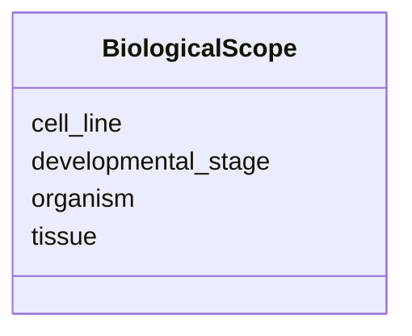

---
search:
  boost: 10.0
---

# Class: BiologicalScope 


_Organism, tissue, cell line, developmental stage._


<div data-search-exclude markdown="1">


URI: [isom:BiologicalScope](https://w3id.org/isom/BiologicalScope)





<!-- no inheritance hierarchy -->

## Slots

| Name | Cardinality and Range | Description | Inheritance |
| ---  | --- | --- | --- |
| [organism](organism.md) | 0..1 <br/> [String](String.md) |  | direct |
| [tissue](tissue.md) | 0..1 <br/> [String](String.md) |  | direct |
| [cell_line](cell_line.md) | 0..1 <br/> [String](String.md) |  | direct |
| [developmental_stage](developmental_stage.md) | 0..1 <br/> [String](String.md) |  | direct |


## Usages

| used by | used in | type | used |
| ---  | --- | --- | --- |
| [Scope](Scope.md) | [biological](biological.md) | range | [BiologicalScope](BiologicalScope.md) |


## Identifier and Mapping Information


### Schema Source


* from schema: https://w3id.org/isom/core


## Mappings

| Mapping Type | Mapped Value |
| ---  | ---  |
| self | isom:BiologicalScope |
| native | isom:BiologicalScope |


## LinkML Source

<!-- TODO: investigate https://stackoverflow.com/questions/37606292/how-to-create-tabbed-code-blocks-in-mkdocs-or-sphinx -->

### Direct

<details>
```yaml
name: BiologicalScope
description: Organism, tissue, cell line, developmental stage.
from_schema: https://w3id.org/isom/core
attributes:
  organism:
    name: organism
    from_schema: https://w3id.org/isom/core
    rank: 1000
    domain_of:
    - BiologicalScope
    range: string
  tissue:
    name: tissue
    from_schema: https://w3id.org/isom/core
    rank: 1000
    domain_of:
    - BiologicalScope
    range: string
  cell_line:
    name: cell_line
    from_schema: https://w3id.org/isom/core
    rank: 1000
    domain_of:
    - BiologicalScope
    range: string
  developmental_stage:
    name: developmental_stage
    from_schema: https://w3id.org/isom/core
    rank: 1000
    domain_of:
    - BiologicalScope
    range: string

```
</details>

### Induced

<details>
```yaml
name: BiologicalScope
description: Organism, tissue, cell line, developmental stage.
from_schema: https://w3id.org/isom/core
attributes:
  organism:
    name: organism
    from_schema: https://w3id.org/isom/core
    rank: 1000
    owner: BiologicalScope
    domain_of:
    - BiologicalScope
    range: string
  tissue:
    name: tissue
    from_schema: https://w3id.org/isom/core
    rank: 1000
    owner: BiologicalScope
    domain_of:
    - BiologicalScope
    range: string
  cell_line:
    name: cell_line
    from_schema: https://w3id.org/isom/core
    rank: 1000
    owner: BiologicalScope
    domain_of:
    - BiologicalScope
    range: string
  developmental_stage:
    name: developmental_stage
    from_schema: https://w3id.org/isom/core
    rank: 1000
    owner: BiologicalScope
    domain_of:
    - BiologicalScope
    range: string

```
</details></div>