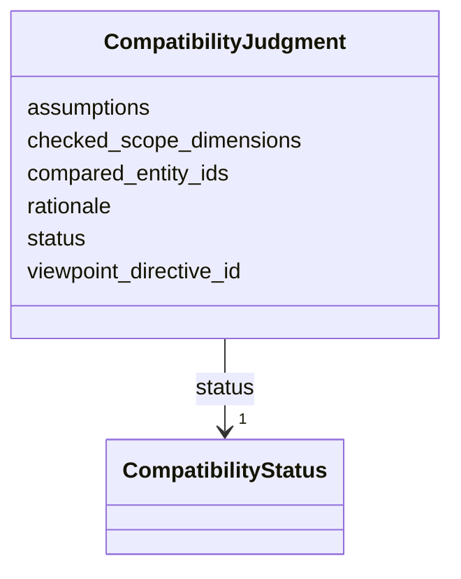

---
search:
  boost: 10.0
---

# Class: CompatibilityJudgment 


_A recorded compatibility judgment over a set of entities/evidence._


<div data-search-exclude markdown="1">


URI: [isom:CompatibilityJudgment](https://w3id.org/isom/CompatibilityJudgment)





<!-- no inheritance hierarchy -->

## Slots

| Name | Cardinality and Range | Description | Inheritance |
| ---  | --- | --- | --- |
| [compared_entity_ids](compared_entity_ids.md) | 1..* <br/> [EntityId](EntityId.md) |  | direct |
| [checked_scope_dimensions](checked_scope_dimensions.md) | * <br/> [String](String.md) |  | direct |
| [assumptions](assumptions.md) | * <br/> [String](String.md) |  | direct |
| [rationale](rationale.md) | 0..1 <br/> [String](String.md) |  | direct |
| [status](status.md) | 1 <br/> [CompatibilityStatus](CompatibilityStatus.md) |  | direct |
| [viewpoint_directive_id](viewpoint_directive_id.md) | 0..1 <br/> [EntityId](EntityId.md) |  | direct |


## Usages

| used by | used in | type | used |
| ---  | --- | --- | --- |
| [Activity](Activity.md) | [compatibility_judgments](compatibility_judgments.md) | range | [CompatibilityJudgment](CompatibilityJudgment.md) |


## Identifier and Mapping Information


### Schema Source


* from schema: https://w3id.org/isom/core


## Mappings

| Mapping Type | Mapped Value |
| ---  | ---  |
| self | isom:CompatibilityJudgment |
| native | isom:CompatibilityJudgment |


## LinkML Source

<!-- TODO: investigate https://stackoverflow.com/questions/37606292/how-to-create-tabbed-code-blocks-in-mkdocs-or-sphinx -->

### Direct

<details>
```yaml
name: CompatibilityJudgment
description: A recorded compatibility judgment over a set of entities/evidence.
from_schema: https://w3id.org/isom/core
attributes:
  compared_entity_ids:
    name: compared_entity_ids
    from_schema: https://w3id.org/isom/core
    rank: 1000
    domain_of:
    - CompatibilityJudgment
    range: EntityId
    required: true
    multivalued: true
  checked_scope_dimensions:
    name: checked_scope_dimensions
    from_schema: https://w3id.org/isom/core
    rank: 1000
    domain_of:
    - CompatibilityJudgment
    range: string
    multivalued: true
  assumptions:
    name: assumptions
    from_schema: https://w3id.org/isom/core
    rank: 1000
    domain_of:
    - CompatibilityJudgment
    - Object
    - Activity
    range: string
    multivalued: true
  rationale:
    name: rationale
    from_schema: https://w3id.org/isom/core
    rank: 1000
    domain_of:
    - CompatibilityJudgment
    range: string
  status:
    name: status
    from_schema: https://w3id.org/isom/core
    rank: 1000
    domain_of:
    - CompatibilityJudgment
    range: CompatibilityStatus
    required: true
  viewpoint_directive_id:
    name: viewpoint_directive_id
    from_schema: https://w3id.org/isom/core
    domain_of:
    - Confidence
    - CompatibilityJudgment
    - Entity
    range: EntityId

```
</details>

### Induced

<details>
```yaml
name: CompatibilityJudgment
description: A recorded compatibility judgment over a set of entities/evidence.
from_schema: https://w3id.org/isom/core
attributes:
  compared_entity_ids:
    name: compared_entity_ids
    from_schema: https://w3id.org/isom/core
    rank: 1000
    owner: CompatibilityJudgment
    domain_of:
    - CompatibilityJudgment
    range: EntityId
    required: true
    multivalued: true
  checked_scope_dimensions:
    name: checked_scope_dimensions
    from_schema: https://w3id.org/isom/core
    rank: 1000
    owner: CompatibilityJudgment
    domain_of:
    - CompatibilityJudgment
    range: string
    multivalued: true
  assumptions:
    name: assumptions
    from_schema: https://w3id.org/isom/core
    rank: 1000
    owner: CompatibilityJudgment
    domain_of:
    - CompatibilityJudgment
    - Object
    - Activity
    range: string
    multivalued: true
  rationale:
    name: rationale
    from_schema: https://w3id.org/isom/core
    rank: 1000
    owner: CompatibilityJudgment
    domain_of:
    - CompatibilityJudgment
    range: string
  status:
    name: status
    from_schema: https://w3id.org/isom/core
    rank: 1000
    owner: CompatibilityJudgment
    domain_of:
    - CompatibilityJudgment
    range: CompatibilityStatus
    required: true
  viewpoint_directive_id:
    name: viewpoint_directive_id
    from_schema: https://w3id.org/isom/core
    owner: CompatibilityJudgment
    domain_of:
    - Confidence
    - CompatibilityJudgment
    - Entity
    range: EntityId

```
</details></div>