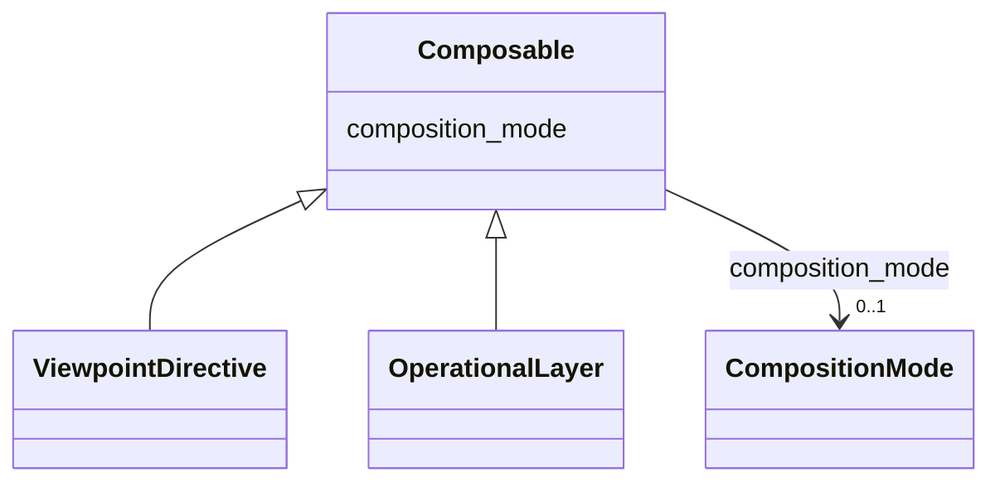

---
search:
  boost: 10.0
---

# Class: Composable 


_Mixin granting a layer a composition_mode. Parent references are NOT in this mixin — each composable class declares its own semantically explicit parent slot (parent_viewpoint_ids, parent_extraction_profile_ids, etc.)._


<div data-search-exclude markdown="1">


URI: [grits:Composable](https://w3id.org/grits/Composable)





<!-- no inheritance hierarchy -->

## Class Properties

| Property | Value |
| --- | --- |
| Mixin | Yes |


## Slots

| Name | Cardinality and Range | Description | Inheritance |
| ---  | --- | --- | --- |
| [composition_mode](composition_mode.md) | 0..1 <br/> [CompositionMode](CompositionMode.md) | How this layer folds against its declared parents during resolution | direct |


## Mixin Usage

| mixed into | description |
| --- | --- |
| [ViewpointDirective](ViewpointDirective.md) | The interpretive frame under which grits are extracted |
| [OperationalLayer](OperationalLayer.md) | Abstract base for composable operational/interpretive layers that are not the... |


## Identifier and Mapping Information


### Schema Source


* from schema: https://w3id.org/grits/core


## Mappings

| Mapping Type | Mapped Value |
| ---  | ---  |
| self | grits:Composable |
| native | grits:Composable |


## LinkML Source

<!-- TODO: investigate https://stackoverflow.com/questions/37606292/how-to-create-tabbed-code-blocks-in-mkdocs-or-sphinx -->

### Direct

<details>
```yaml
name: Composable
description: Mixin granting a layer a composition_mode. Parent references are NOT
  in this mixin — each composable class declares its own semantically explicit parent
  slot (parent_viewpoint_ids, parent_extraction_profile_ids, etc.).
from_schema: https://w3id.org/grits/core
mixin: true
attributes:
  composition_mode:
    name: composition_mode
    description: How this layer folds against its declared parents during resolution.
      Defaults to additive.
    from_schema: https://w3id.org/grits/core
    rank: 1000
    ifabsent: string(additive)
    domain_of:
    - Composable
    range: CompositionMode

```
</details>

### Induced

<details>
```yaml
name: Composable
description: Mixin granting a layer a composition_mode. Parent references are NOT
  in this mixin — each composable class declares its own semantically explicit parent
  slot (parent_viewpoint_ids, parent_extraction_profile_ids, etc.).
from_schema: https://w3id.org/grits/core
mixin: true
attributes:
  composition_mode:
    name: composition_mode
    description: How this layer folds against its declared parents during resolution.
      Defaults to additive.
    from_schema: https://w3id.org/grits/core
    rank: 1000
    ifabsent: string(additive)
    owner: Composable
    domain_of:
    - Composable
    range: CompositionMode

```
</details></div>