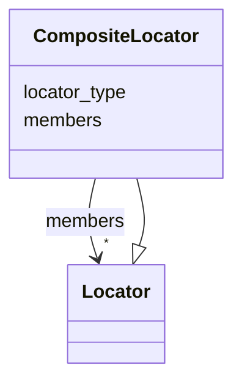

---
search:
  boost: 10.0
---

# Class: CompositeLocator 


_A locator that combines multiple sub-locators._


<div data-search-exclude markdown="1">


URI: [grits:CompositeLocator](https://w3id.org/grits/CompositeLocator)





## Inheritance
* [Locator](Locator.md)
    * **CompositeLocator**


## Slots

| Name | Cardinality and Range | Description | Inheritance |
| ---  | --- | --- | --- |
| [members](members.md) | * <br/> [Locator](Locator.md) |  | direct |
| [locator_type](locator_type.md) | 1 <br/> [String](String.md) | Class name of the concrete Locator subclass (e | [Locator](Locator.md) |


## Identifier and Mapping Information


### Schema Source


* from schema: https://w3id.org/grits/core


## Mappings

| Mapping Type | Mapped Value |
| ---  | ---  |
| self | grits:CompositeLocator |
| native | grits:CompositeLocator |


## LinkML Source

<!-- TODO: investigate https://stackoverflow.com/questions/37606292/how-to-create-tabbed-code-blocks-in-mkdocs-or-sphinx -->

### Direct

<details>
```yaml
name: CompositeLocator
description: A locator that combines multiple sub-locators.
from_schema: https://w3id.org/grits/core
is_a: Locator
attributes:
  members:
    name: members
    from_schema: https://w3id.org/grits/core
    rank: 1000
    domain_of:
    - CompositeLocator
    range: Locator
    multivalued: true
    inlined: true
    inlined_as_list: true

```
</details>

### Induced

<details>
```yaml
name: CompositeLocator
description: A locator that combines multiple sub-locators.
from_schema: https://w3id.org/grits/core
is_a: Locator
attributes:
  members:
    name: members
    from_schema: https://w3id.org/grits/core
    rank: 1000
    owner: CompositeLocator
    domain_of:
    - CompositeLocator
    range: Locator
    multivalued: true
    inlined: true
    inlined_as_list: true
  locator_type:
    name: locator_type
    description: Class name of the concrete Locator subclass (e.g. CharRangeLocator).
    from_schema: https://w3id.org/grits/core
    rank: 1000
    designates_type: true
    owner: CompositeLocator
    domain_of:
    - Locator
    range: string
    required: true

```
</details></div>