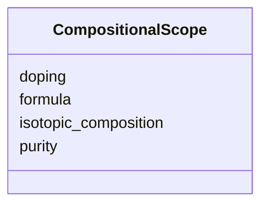

---
search:
  boost: 10.0
---

# Class: CompositionalScope 


_Formula, purity, doping, isotopic composition._


<div data-search-exclude markdown="1">


URI: [isom:CompositionalScope](https://w3id.org/isom/CompositionalScope)





<!-- no inheritance hierarchy -->

## Slots

| Name | Cardinality and Range | Description | Inheritance |
| ---  | --- | --- | --- |
| [formula](formula.md) | 0..1 <br/> [String](String.md) |  | direct |
| [purity](purity.md) | 0..1 <br/> [String](String.md) |  | direct |
| [doping](doping.md) | 0..1 <br/> [String](String.md) |  | direct |
| [isotopic_composition](isotopic_composition.md) | 0..1 <br/> [String](String.md) |  | direct |


## Usages

| used by | used in | type | used |
| ---  | --- | --- | --- |
| [Scope](Scope.md) | [compositional](compositional.md) | range | [CompositionalScope](CompositionalScope.md) |


## Identifier and Mapping Information


### Schema Source


* from schema: https://w3id.org/isom/core


## Mappings

| Mapping Type | Mapped Value |
| ---  | ---  |
| self | isom:CompositionalScope |
| native | isom:CompositionalScope |


## LinkML Source

<!-- TODO: investigate https://stackoverflow.com/questions/37606292/how-to-create-tabbed-code-blocks-in-mkdocs-or-sphinx -->

### Direct

<details>
```yaml
name: CompositionalScope
description: Formula, purity, doping, isotopic composition.
from_schema: https://w3id.org/isom/core
attributes:
  formula:
    name: formula
    from_schema: https://w3id.org/isom/core
    rank: 1000
    domain_of:
    - CompositionalScope
    range: string
  purity:
    name: purity
    from_schema: https://w3id.org/isom/core
    rank: 1000
    domain_of:
    - CompositionalScope
    range: string
  doping:
    name: doping
    from_schema: https://w3id.org/isom/core
    rank: 1000
    domain_of:
    - CompositionalScope
    range: string
  isotopic_composition:
    name: isotopic_composition
    from_schema: https://w3id.org/isom/core
    rank: 1000
    domain_of:
    - CompositionalScope
    range: string

```
</details>

### Induced

<details>
```yaml
name: CompositionalScope
description: Formula, purity, doping, isotopic composition.
from_schema: https://w3id.org/isom/core
attributes:
  formula:
    name: formula
    from_schema: https://w3id.org/isom/core
    rank: 1000
    owner: CompositionalScope
    domain_of:
    - CompositionalScope
    range: string
  purity:
    name: purity
    from_schema: https://w3id.org/isom/core
    rank: 1000
    owner: CompositionalScope
    domain_of:
    - CompositionalScope
    range: string
  doping:
    name: doping
    from_schema: https://w3id.org/isom/core
    rank: 1000
    owner: CompositionalScope
    domain_of:
    - CompositionalScope
    range: string
  isotopic_composition:
    name: isotopic_composition
    from_schema: https://w3id.org/isom/core
    rank: 1000
    owner: CompositionalScope
    domain_of:
    - CompositionalScope
    range: string

```
</details></div>