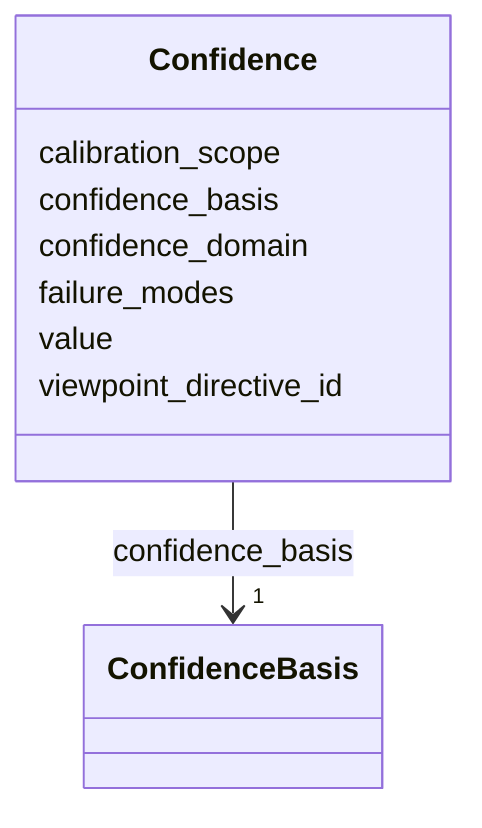

---
search:
  boost: 10.0
---

# Class: Confidence 


_Structured confidence carrying calibration metadata. A calibrated confidence outside its calibration_domain or under a different viewpoint is no longer calibrated — downstream consumers must downgrade to heuristic._


<div data-search-exclude markdown="1">


URI: [grits:Confidence](https://w3id.org/grits/Confidence)





<!-- no inheritance hierarchy -->

## Slots

| Name | Cardinality and Range | Description | Inheritance |
| ---  | --- | --- | --- |
| [value](value.md) | 0..1 <br/> [Float](Float.md) | Numeric confidence; semantics depend on confidence_basis | direct |
| [confidence_basis](confidence_basis.md) | 1 <br/> [ConfidenceBasis](ConfidenceBasis.md) |  | direct |
| [calibration_scope](calibration_scope.md) | 0..1 <br/> [String](String.md) | The data distribution under which the confidence was calibrated | direct |
| [confidence_domain](confidence_domain.md) | 0..1 <br/> [String](String.md) | The input domain where the calibration applies | direct |
| [failure_modes](failure_modes.md) | * <br/> [String](String.md) |  | direct |
| [viewpoint_directive_id](viewpoint_directive_id.md) | 0..1 <br/> [GritId](GritId.md) | Viewpoint under which calibration was performed | direct |


## Usages

| used by | used in | type | used |
| ---  | --- | --- | --- |
| [Activity](Activity.md) | [confidence](confidence.md) | range | [Confidence](Confidence.md) |
| [EvidenceRecord](EvidenceRecord.md) | [extraction_confidence](extraction_confidence.md) | range | [Confidence](Confidence.md) |
| [NegativeEvidenceRecord](NegativeEvidenceRecord.md) | [search_confidence](search_confidence.md) | range | [Confidence](Confidence.md) |
| [NegativeEvidenceRecord](NegativeEvidenceRecord.md) | [extraction_confidence](extraction_confidence.md) | range | [Confidence](Confidence.md) |


## Identifier and Mapping Information


### Schema Source


* from schema: https://w3id.org/grits/core


## Mappings

| Mapping Type | Mapped Value |
| ---  | ---  |
| self | grits:Confidence |
| native | grits:Confidence |


## LinkML Source

<!-- TODO: investigate https://stackoverflow.com/questions/37606292/how-to-create-tabbed-code-blocks-in-mkdocs-or-sphinx -->

### Direct

<details>
```yaml
name: Confidence
description: Structured confidence carrying calibration metadata. A calibrated confidence
  outside its calibration_domain or under a different viewpoint is no longer calibrated
  — downstream consumers must downgrade to heuristic.
from_schema: https://w3id.org/grits/core
attributes:
  value:
    name: value
    description: Numeric confidence; semantics depend on confidence_basis.
    from_schema: https://w3id.org/grits/core
    rank: 1000
    domain_of:
    - Confidence
    range: float
  confidence_basis:
    name: confidence_basis
    from_schema: https://w3id.org/grits/core
    rank: 1000
    domain_of:
    - Confidence
    range: ConfidenceBasis
    required: true
  calibration_scope:
    name: calibration_scope
    description: The data distribution under which the confidence was calibrated.
    from_schema: https://w3id.org/grits/core
    rank: 1000
    domain_of:
    - Confidence
    range: string
  confidence_domain:
    name: confidence_domain
    description: The input domain where the calibration applies.
    from_schema: https://w3id.org/grits/core
    rank: 1000
    domain_of:
    - Confidence
    range: string
  failure_modes:
    name: failure_modes
    from_schema: https://w3id.org/grits/core
    rank: 1000
    domain_of:
    - Confidence
    range: string
    multivalued: true
  viewpoint_directive_id:
    name: viewpoint_directive_id
    description: Viewpoint under which calibration was performed.
    from_schema: https://w3id.org/grits/core
    rank: 1000
    domain_of:
    - Confidence
    - CompatibilityJudgment
    - Grit
    range: GritId

```
</details>

### Induced

<details>
```yaml
name: Confidence
description: Structured confidence carrying calibration metadata. A calibrated confidence
  outside its calibration_domain or under a different viewpoint is no longer calibrated
  — downstream consumers must downgrade to heuristic.
from_schema: https://w3id.org/grits/core
attributes:
  value:
    name: value
    description: Numeric confidence; semantics depend on confidence_basis.
    from_schema: https://w3id.org/grits/core
    rank: 1000
    owner: Confidence
    domain_of:
    - Confidence
    range: float
  confidence_basis:
    name: confidence_basis
    from_schema: https://w3id.org/grits/core
    rank: 1000
    owner: Confidence
    domain_of:
    - Confidence
    range: ConfidenceBasis
    required: true
  calibration_scope:
    name: calibration_scope
    description: The data distribution under which the confidence was calibrated.
    from_schema: https://w3id.org/grits/core
    rank: 1000
    owner: Confidence
    domain_of:
    - Confidence
    range: string
  confidence_domain:
    name: confidence_domain
    description: The input domain where the calibration applies.
    from_schema: https://w3id.org/grits/core
    rank: 1000
    owner: Confidence
    domain_of:
    - Confidence
    range: string
  failure_modes:
    name: failure_modes
    from_schema: https://w3id.org/grits/core
    rank: 1000
    owner: Confidence
    domain_of:
    - Confidence
    range: string
    multivalued: true
  viewpoint_directive_id:
    name: viewpoint_directive_id
    description: Viewpoint under which calibration was performed.
    from_schema: https://w3id.org/grits/core
    rank: 1000
    owner: Confidence
    domain_of:
    - Confidence
    - CompatibilityJudgment
    - Grit
    range: GritId

```
</details></div>