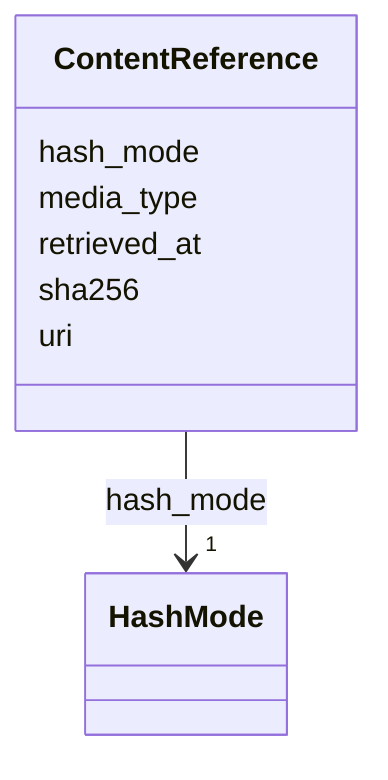

---
search:
  boost: 10.0
---

# Class: ContentReference 


_Content-addressed reference to externally stored content. Identity by uri + sha256 + hash_mode. At resolution time, the system fetches uri, recomputes the hash under hash_mode, and refuses to use the content if the hash does not match._


<div data-search-exclude markdown="1">


URI: [grits:ContentReference](https://w3id.org/grits/ContentReference)





<!-- no inheritance hierarchy -->

## Slots

| Name | Cardinality and Range | Description | Inheritance |
| ---  | --- | --- | --- |
| [uri](uri.md) | 1 <br/> [String](String.md) | Locator (file path, https URL, did: | direct |
| [sha256](sha256.md) | 1 <br/> [Sha256Hex](Sha256Hex.md) | Integrity check on the content | direct |
| [hash_mode](hash_mode.md) | 1 <br/> [HashMode](HashMode.md) | How the sha256 was computed | direct |
| [media_type](media_type.md) | 0..1 <br/> [String](String.md) | MIME type for disambiguation | direct |
| [retrieved_at](retrieved_at.md) | 0..1 <br/> [Iso8601](Iso8601.md) | Last successful integrity verification timestamp | direct |


## Usages

| used by | used in | type | used |
| ---  | --- | --- | --- |
| [Object](Object.md) | [source_artifact_refs](source_artifact_refs.md) | range | [ContentReference](ContentReference.md) |
| [EvidenceRecord](EvidenceRecord.md) | [source_artifact_ref](source_artifact_ref.md) | range | [ContentReference](ContentReference.md) |
| [ViewpointDirective](ViewpointDirective.md) | [prompts](prompts.md) | range | [ContentReference](ContentReference.md) |
| [ViewpointDirective](ViewpointDirective.md) | [exemplars](exemplars.md) | range | [ContentReference](ContentReference.md) |
| [ViewpointDirective](ViewpointDirective.md) | [vocabulary_refs](vocabulary_refs.md) | range | [ContentReference](ContentReference.md) |
| [ViewpointDirective](ViewpointDirective.md) | [target_schema](target_schema.md) | range | [ContentReference](ContentReference.md) |
| [ViewpointDirective](ViewpointDirective.md) | [source_artifact_refs](source_artifact_refs.md) | range | [ContentReference](ContentReference.md) |
| [NegativeEvidenceRecord](NegativeEvidenceRecord.md) | [source_artifact_ref](source_artifact_ref.md) | range | [ContentReference](ContentReference.md) |
| [OperationalLayer](OperationalLayer.md) | [source_artifact_refs](source_artifact_refs.md) | range | [ContentReference](ContentReference.md) |
| [ExtractionProfile](ExtractionProfile.md) | [source_artifact_refs](source_artifact_refs.md) | range | [ContentReference](ContentReference.md) |
| [VocabularyPack](VocabularyPack.md) | [vocabulary_refs](vocabulary_refs.md) | range | [ContentReference](ContentReference.md) |
| [VocabularyPack](VocabularyPack.md) | [ontology_refs](ontology_refs.md) | range | [ContentReference](ContentReference.md) |
| [VocabularyPack](VocabularyPack.md) | [source_artifact_refs](source_artifact_refs.md) | range | [ContentReference](ContentReference.md) |
| [ReasoningPolicy](ReasoningPolicy.md) | [source_artifact_refs](source_artifact_refs.md) | range | [ContentReference](ContentReference.md) |
| [ComposedViewpointDirective](ComposedViewpointDirective.md) | [prompts](prompts.md) | range | [ContentReference](ContentReference.md) |
| [ComposedViewpointDirective](ComposedViewpointDirective.md) | [exemplars](exemplars.md) | range | [ContentReference](ContentReference.md) |
| [ComposedViewpointDirective](ComposedViewpointDirective.md) | [vocabulary_refs](vocabulary_refs.md) | range | [ContentReference](ContentReference.md) |
| [ComposedViewpointDirective](ComposedViewpointDirective.md) | [target_schema](target_schema.md) | range | [ContentReference](ContentReference.md) |
| [ComposedViewpointDirective](ComposedViewpointDirective.md) | [source_artifact_refs](source_artifact_refs.md) | range | [ContentReference](ContentReference.md) |


## Identifier and Mapping Information


### Schema Source


* from schema: https://w3id.org/grits/core


## Mappings

| Mapping Type | Mapped Value |
| ---  | ---  |
| self | grits:ContentReference |
| native | grits:ContentReference |


## LinkML Source

<!-- TODO: investigate https://stackoverflow.com/questions/37606292/how-to-create-tabbed-code-blocks-in-mkdocs-or-sphinx -->

### Direct

<details>
```yaml
name: ContentReference
description: Content-addressed reference to externally stored content. Identity by
  uri + sha256 + hash_mode. At resolution time, the system fetches uri, recomputes
  the hash under hash_mode, and refuses to use the content if the hash does not match.
from_schema: https://w3id.org/grits/core
attributes:
  uri:
    name: uri
    description: Locator (file path, https URL, did:..., cid:...).
    from_schema: https://w3id.org/grits/core
    rank: 1000
    domain_of:
    - ContentReference
    required: true
  sha256:
    name: sha256
    description: Integrity check on the content.
    from_schema: https://w3id.org/grits/core
    rank: 1000
    domain_of:
    - ContentReference
    range: Sha256Hex
    required: true
    pattern: ^[a-f0-9]{64}$
  hash_mode:
    name: hash_mode
    description: How the sha256 was computed.
    from_schema: https://w3id.org/grits/core
    rank: 1000
    domain_of:
    - ContentReference
    range: HashMode
    required: true
  media_type:
    name: media_type
    description: MIME type for disambiguation.
    from_schema: https://w3id.org/grits/core
    rank: 1000
    domain_of:
    - ContentReference
    required: false
  retrieved_at:
    name: retrieved_at
    description: Last successful integrity verification timestamp.
    from_schema: https://w3id.org/grits/core
    rank: 1000
    domain_of:
    - ContentReference
    range: Iso8601
    required: false

```
</details>

### Induced

<details>
```yaml
name: ContentReference
description: Content-addressed reference to externally stored content. Identity by
  uri + sha256 + hash_mode. At resolution time, the system fetches uri, recomputes
  the hash under hash_mode, and refuses to use the content if the hash does not match.
from_schema: https://w3id.org/grits/core
attributes:
  uri:
    name: uri
    description: Locator (file path, https URL, did:..., cid:...).
    from_schema: https://w3id.org/grits/core
    rank: 1000
    owner: ContentReference
    domain_of:
    - ContentReference
    range: string
    required: true
  sha256:
    name: sha256
    description: Integrity check on the content.
    from_schema: https://w3id.org/grits/core
    rank: 1000
    owner: ContentReference
    domain_of:
    - ContentReference
    range: Sha256Hex
    required: true
    pattern: ^[a-f0-9]{64}$
  hash_mode:
    name: hash_mode
    description: How the sha256 was computed.
    from_schema: https://w3id.org/grits/core
    rank: 1000
    owner: ContentReference
    domain_of:
    - ContentReference
    range: HashMode
    required: true
  media_type:
    name: media_type
    description: MIME type for disambiguation.
    from_schema: https://w3id.org/grits/core
    rank: 1000
    owner: ContentReference
    domain_of:
    - ContentReference
    range: string
    required: false
  retrieved_at:
    name: retrieved_at
    description: Last successful integrity verification timestamp.
    from_schema: https://w3id.org/grits/core
    rank: 1000
    owner: ContentReference
    domain_of:
    - ContentReference
    range: Iso8601
    required: false

```
</details></div>