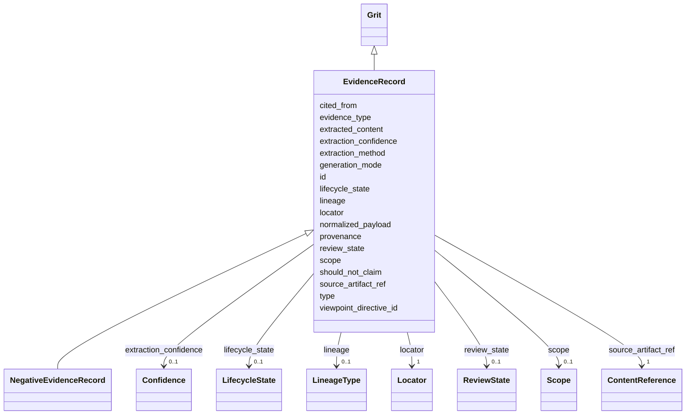

---
search:
  boost: 10.0
---

# Class: EvidenceRecord 


_Anchor unit. Grounded data anchored to a single source artifact via a typed locator. Referenced by Objects' evidence_record_ids and by Activities' inputs._


<div data-search-exclude markdown="1">


URI: [grits:EvidenceRecord](https://w3id.org/grits/EvidenceRecord)





## Inheritance
* [Grit](Grit.md)
    * **EvidenceRecord**
        * [NegativeEvidenceRecord](NegativeEvidenceRecord.md)


## Slots

| Name | Cardinality and Range | Description | Inheritance |
| ---  | --- | --- | --- |
| [source_artifact_ref](source_artifact_ref.md) | 1 <br/> [ContentReference](ContentReference.md) | Single source artifact this evidence is extracted from | direct |
| [locator](locator.md) | 1 <br/> [Locator](Locator.md) |  | direct |
| [extracted_content](extracted_content.md) | 0..1 <br/> [String](String.md) |  | direct |
| [normalized_payload](normalized_payload.md) | 0..1 <br/> [String](String.md) | Viewpoint-defined structured payload, serialized as a JSON string in v1 | direct |
| [evidence_type](evidence_type.md) | 0..1 <br/> [CurieOrUri](CurieOrUri.md) | CURIE identifying the kind of scientific content the locator anchors | direct |
| [extraction_method](extraction_method.md) | 0..1 <br/> [String](String.md) |  | direct |
| [extraction_confidence](extraction_confidence.md) | 0..1 <br/> [Confidence](Confidence.md) |  | direct |
| [lineage](lineage.md) | 0..1 <br/> [LineageType](LineageType.md) |  | direct |
| [cited_from](cited_from.md) | 0..1 <br/> [String](String.md) | Identifier or marker for prior evidence this record derives from or cites | direct |
| [id](id.md) | 1 <br/> [GritId](GritId.md) | Canonical grit identifier | [Grit](Grit.md) |
| [type](type.md) | 1 <br/> [CurieOrUri](CurieOrUri.md) | For Object and EvidenceRecord, a CURIE into a viewpoint vocabulary | [Grit](Grit.md) |
| [viewpoint_directive_id](viewpoint_directive_id.md) | 1 <br/> [GritId](GritId.md) | Reference to the ViewpointDirective that shaped this grit | [Grit](Grit.md) |
| [provenance](provenance.md) | 1 <br/> [String](String.md) | Provenance description for v1 | [Grit](Grit.md) |
| [should_not_claim](should_not_claim.md) | 1..* <br/> [String](String.md) | Epistemic boundaries this grit must respect | [Grit](Grit.md) |
| [scope](scope.md) | 0..1 <br/> [Scope](Scope.md) | Optional but recommended | [Grit](Grit.md) |
| [review_state](review_state.md) | 0..1 <br/> [ReviewState](ReviewState.md) |  | [Grit](Grit.md) |
| [lifecycle_state](lifecycle_state.md) | 0..1 <br/> [LifecycleState](LifecycleState.md) |  | [Grit](Grit.md) |
| [generation_mode](generation_mode.md) | 0..1 <br/> [String](String.md) | Free-form descriptor of the process that generated this grit (parser name + v... | [Grit](Grit.md) |


## Identifier and Mapping Information


### Schema Source


* from schema: https://w3id.org/grits/core


## Mappings

| Mapping Type | Mapped Value |
| ---  | ---  |
| self | grits:EvidenceRecord |
| native | grits:EvidenceRecord |


## LinkML Source

<!-- TODO: investigate https://stackoverflow.com/questions/37606292/how-to-create-tabbed-code-blocks-in-mkdocs-or-sphinx -->

### Direct

<details>
```yaml
name: EvidenceRecord
description: Anchor unit. Grounded data anchored to a single source artifact via a
  typed locator. Referenced by Objects' evidence_record_ids and by Activities' inputs.
from_schema: https://w3id.org/grits/core
is_a: Grit
attributes:
  source_artifact_ref:
    name: source_artifact_ref
    description: Single source artifact this evidence is extracted from.
    in_subset:
    - MVE
    from_schema: https://w3id.org/grits/core
    rank: 1000
    domain_of:
    - EvidenceRecord
    range: ContentReference
    required: true
    inlined: true
  locator:
    name: locator
    in_subset:
    - MVE
    from_schema: https://w3id.org/grits/core
    rank: 1000
    domain_of:
    - EvidenceRecord
    range: Locator
    required: true
    inlined: true
  extracted_content:
    name: extracted_content
    from_schema: https://w3id.org/grits/core
    rank: 1000
    domain_of:
    - EvidenceRecord
    range: string
  normalized_payload:
    name: normalized_payload
    description: Viewpoint-defined structured payload, serialized as a JSON string
      in v1.
    from_schema: https://w3id.org/grits/core
    rank: 1000
    domain_of:
    - EvidenceRecord
    range: string
  evidence_type:
    name: evidence_type
    description: CURIE identifying the kind of scientific content the locator anchors.
      No core-supplied permissible values; viewpoints supply the evidence-type vocabulary
      they use.
    from_schema: https://w3id.org/grits/core
    rank: 1000
    domain_of:
    - EvidenceRecord
    range: CurieOrUri
  extraction_method:
    name: extraction_method
    from_schema: https://w3id.org/grits/core
    rank: 1000
    domain_of:
    - EvidenceRecord
    range: string
  extraction_confidence:
    name: extraction_confidence
    from_schema: https://w3id.org/grits/core
    rank: 1000
    domain_of:
    - EvidenceRecord
    range: Confidence
    inlined: true
  lineage:
    name: lineage
    from_schema: https://w3id.org/grits/core
    rank: 1000
    domain_of:
    - EvidenceRecord
    range: LineageType
  cited_from:
    name: cited_from
    description: Identifier or marker for prior evidence this record derives from
      or cites. May be `unknown_external` when citation resolution has not happened.
    from_schema: https://w3id.org/grits/core
    rank: 1000
    domain_of:
    - EvidenceRecord
    range: string

```
</details>

### Induced

<details>
```yaml
name: EvidenceRecord
description: Anchor unit. Grounded data anchored to a single source artifact via a
  typed locator. Referenced by Objects' evidence_record_ids and by Activities' inputs.
from_schema: https://w3id.org/grits/core
is_a: Grit
attributes:
  source_artifact_ref:
    name: source_artifact_ref
    description: Single source artifact this evidence is extracted from.
    in_subset:
    - MVE
    from_schema: https://w3id.org/grits/core
    rank: 1000
    owner: EvidenceRecord
    domain_of:
    - EvidenceRecord
    range: ContentReference
    required: true
    inlined: true
  locator:
    name: locator
    in_subset:
    - MVE
    from_schema: https://w3id.org/grits/core
    rank: 1000
    owner: EvidenceRecord
    domain_of:
    - EvidenceRecord
    range: Locator
    required: true
    inlined: true
  extracted_content:
    name: extracted_content
    from_schema: https://w3id.org/grits/core
    rank: 1000
    owner: EvidenceRecord
    domain_of:
    - EvidenceRecord
    range: string
  normalized_payload:
    name: normalized_payload
    description: Viewpoint-defined structured payload, serialized as a JSON string
      in v1.
    from_schema: https://w3id.org/grits/core
    rank: 1000
    owner: EvidenceRecord
    domain_of:
    - EvidenceRecord
    range: string
  evidence_type:
    name: evidence_type
    description: CURIE identifying the kind of scientific content the locator anchors.
      No core-supplied permissible values; viewpoints supply the evidence-type vocabulary
      they use.
    from_schema: https://w3id.org/grits/core
    rank: 1000
    owner: EvidenceRecord
    domain_of:
    - EvidenceRecord
    range: CurieOrUri
  extraction_method:
    name: extraction_method
    from_schema: https://w3id.org/grits/core
    rank: 1000
    owner: EvidenceRecord
    domain_of:
    - EvidenceRecord
    range: string
  extraction_confidence:
    name: extraction_confidence
    from_schema: https://w3id.org/grits/core
    rank: 1000
    owner: EvidenceRecord
    domain_of:
    - EvidenceRecord
    range: Confidence
    inlined: true
  lineage:
    name: lineage
    from_schema: https://w3id.org/grits/core
    rank: 1000
    owner: EvidenceRecord
    domain_of:
    - EvidenceRecord
    range: LineageType
  cited_from:
    name: cited_from
    description: Identifier or marker for prior evidence this record derives from
      or cites. May be `unknown_external` when citation resolution has not happened.
    from_schema: https://w3id.org/grits/core
    rank: 1000
    owner: EvidenceRecord
    domain_of:
    - EvidenceRecord
    range: string
  id:
    name: id
    description: Canonical grit identifier.
    in_subset:
    - MVE
    from_schema: https://w3id.org/grits/core
    rank: 1000
    identifier: true
    owner: EvidenceRecord
    domain_of:
    - Grit
    range: GritId
    required: true
  type:
    name: type
    description: For Object and EvidenceRecord, a CURIE into a viewpoint vocabulary.
      For Activity, a CURIE corresponding to the ActivityType value (e.g. grits:activity_type/synthesis_edge).
    in_subset:
    - MVE
    from_schema: https://w3id.org/grits/core
    rank: 1000
    owner: EvidenceRecord
    domain_of:
    - Grit
    range: CurieOrUri
    required: true
  viewpoint_directive_id:
    name: viewpoint_directive_id
    description: Reference to the ViewpointDirective that shaped this grit. The bootstrap
      meta-viewpoint and the blank-slate viewpoint are valid references; absence is
      not.
    in_subset:
    - MVE
    from_schema: https://w3id.org/grits/core
    owner: EvidenceRecord
    domain_of:
    - Confidence
    - CompatibilityJudgment
    - Grit
    range: GritId
    required: true
  provenance:
    name: provenance
    description: Provenance description for v1. Future versions will model provenance
      as structured edges into the hyperDAG; for now a free-form string is accepted
      to allow ingestion bundles from upstream extraction tools.
    in_subset:
    - MVE
    from_schema: https://w3id.org/grits/core
    rank: 1000
    owner: EvidenceRecord
    domain_of:
    - Grit
    range: string
    required: true
  should_not_claim:
    name: should_not_claim
    description: Epistemic boundaries this grit must respect. Combination of per-class
      defaults plus directive-imposed rules from the viewpoint.
    in_subset:
    - MVE
    from_schema: https://w3id.org/grits/core
    rank: 1000
    owner: EvidenceRecord
    domain_of:
    - Grit
    range: string
    required: true
    multivalued: true
  scope:
    name: scope
    description: Optional but recommended. Viewpoint-supplied scope dimensions describing
      the conditions under which this grit's statements apply. The core Scope marker
      carries no domain dimensions; load a viewpoint schema to populate them.
    from_schema: https://w3id.org/grits/core
    rank: 1000
    owner: EvidenceRecord
    domain_of:
    - Grit
    range: Scope
    inlined: true
  review_state:
    name: review_state
    from_schema: https://w3id.org/grits/core
    rank: 1000
    owner: EvidenceRecord
    domain_of:
    - Grit
    range: ReviewState
  lifecycle_state:
    name: lifecycle_state
    from_schema: https://w3id.org/grits/core
    rank: 1000
    owner: EvidenceRecord
    domain_of:
    - Grit
    range: LifecycleState
  generation_mode:
    name: generation_mode
    description: Free-form descriptor of the process that generated this grit (parser
      name + version, viewpoint name + version, LLM model + tier).
    from_schema: https://w3id.org/grits/core
    rank: 1000
    owner: EvidenceRecord
    domain_of:
    - Grit
    range: string

```
</details></div>