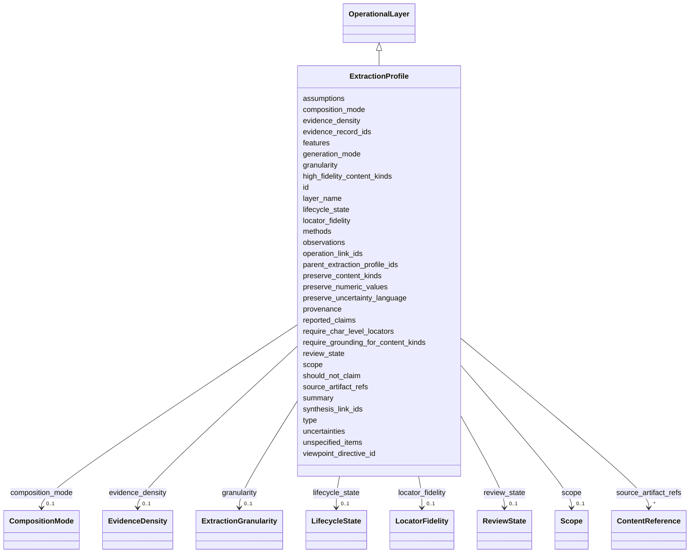

---
search:
  boost: 10.0
---

# Class: ExtractionProfile 


_Extraction/grounding semantics: how finely content is decomposed, how densely claims are grounded, and what locator fidelity is expected. Core understands only abstract content kinds identified by CURIEs; the semantic meaning of those CURIEs is supplied by viewpoint vocabularies. This layer carries no infrastructure settings (no retry, OCR, chunking, parallelism, transport, or cache concerns). Supported composition modes: additive, overriding._


<div data-search-exclude markdown="1">


URI: [grits:ExtractionProfile](https://w3id.org/grits/ExtractionProfile)





## Inheritance
* [Grit](Grit.md)
    * [Object](Object.md)
        * [OperationalLayer](OperationalLayer.md) [ [Composable](Composable.md)]
            * **ExtractionProfile**


## Slots

| Name | Cardinality and Range | Description | Inheritance |
| ---  | --- | --- | --- |
| [parent_extraction_profile_ids](parent_extraction_profile_ids.md) | * <br/> [GritId](GritId.md) | ExtractionProfile ids this profile composes from, parents-first | direct |
| [granularity](granularity.md) | 0..1 <br/> [ExtractionGranularity](ExtractionGranularity.md) | How finely content should be decomposed during extraction | direct |
| [evidence_density](evidence_density.md) | 0..1 <br/> [EvidenceDensity](EvidenceDensity.md) | How densely claims should be grounded in evidence | direct |
| [locator_fidelity](locator_fidelity.md) | 0..1 <br/> [LocatorFidelity](LocatorFidelity.md) | Expected locator granularity for anchored content | direct |
| [preserve_numeric_values](preserve_numeric_values.md) | 0..1 <br/> [Boolean](Boolean.md) | Whether reported numeric values must be preserved verbatim | direct |
| [preserve_uncertainty_language](preserve_uncertainty_language.md) | 0..1 <br/> [Boolean](Boolean.md) | Whether uncertainty/hedging language must be preserved verbatim | direct |
| [require_char_level_locators](require_char_level_locators.md) | 0..1 <br/> [Boolean](Boolean.md) | Whether anchored content requires character-level locators | direct |
| [preserve_content_kinds](preserve_content_kinds.md) | * <br/> [CurieOrUri](CurieOrUri.md) | Content kinds (viewpoint-supplied CURIEs) whose content must be preserved | direct |
| [require_grounding_for_content_kinds](require_grounding_for_content_kinds.md) | * <br/> [CurieOrUri](CurieOrUri.md) | Content kinds (viewpoint-supplied CURIEs) that must be grounded in an evidenc... | direct |
| [high_fidelity_content_kinds](high_fidelity_content_kinds.md) | * <br/> [CurieOrUri](CurieOrUri.md) | Content kinds (viewpoint-supplied CURIEs) requiring high-fidelity locators an... | direct |
| [layer_name](layer_name.md) | 1 <br/> [String](String.md) | Human-readable name (e | [OperationalLayer](OperationalLayer.md) |
| [composition_mode](composition_mode.md) | 0..1 <br/> [CompositionMode](CompositionMode.md) | How this layer folds against its declared parents during resolution | [Composable](Composable.md) |
| [source_artifact_refs](source_artifact_refs.md) | * <br/> [ContentReference](ContentReference.md) | ContentReferences to the source artifacts this Object derives from | [Object](Object.md) |
| [evidence_record_ids](evidence_record_ids.md) | * <br/> [GritId](GritId.md) | References to EvidenceRecord grits anchoring this Object's claims | [Object](Object.md) |
| [summary](summary.md) | 0..1 <br/> [String](String.md) |  | [Object](Object.md) |
| [features](features.md) | 0..1 <br/> [String](String.md) | Viewpoint-defined structured payload, serialized as a JSON string in v1 | [Object](Object.md) |
| [observations](observations.md) | * <br/> [String](String.md) |  | [Object](Object.md) |
| [unspecified_items](unspecified_items.md) | * <br/> [String](String.md) | Dimensions or claims not bound under the current viewpoint | [Object](Object.md) |
| [reported_claims](reported_claims.md) | * <br/> [String](String.md) |  | [Object](Object.md) |
| [methods](methods.md) | * <br/> [String](String.md) |  | [Object](Object.md) |
| [assumptions](assumptions.md) | * <br/> [String](String.md) |  | [Object](Object.md) |
| [uncertainties](uncertainties.md) | * <br/> [String](String.md) |  | [Object](Object.md) |
| [synthesis_link_ids](synthesis_link_ids.md) | * <br/> [GritId](GritId.md) | Backward pointers to Activities that referenced this Object as input or outpu... | [Object](Object.md) |
| [operation_link_ids](operation_link_ids.md) | * <br/> [GritId](GritId.md) | Backward pointers to ACTION_EDGE Activities involving this Object | [Object](Object.md) |
| [id](id.md) | 1 <br/> [GritId](GritId.md) | Canonical grit identifier | [Grit](Grit.md) |
| [type](type.md) | 1 <br/> [CurieOrUri](CurieOrUri.md) | For Object and EvidenceRecord, a CURIE into a viewpoint vocabulary | [Grit](Grit.md) |
| [viewpoint_directive_id](viewpoint_directive_id.md) | 1 <br/> [GritId](GritId.md) | Reference to the ViewpointDirective that shaped this grit | [Grit](Grit.md) |
| [provenance](provenance.md) | 1 <br/> [String](String.md) | Provenance description for v1 | [Grit](Grit.md) |
| [should_not_claim](should_not_claim.md) | 1..* <br/> [String](String.md) | Epistemic boundaries this grit must respect | [Grit](Grit.md) |
| [scope](scope.md) | 0..1 <br/> [Scope](Scope.md) | Optional but recommended | [Grit](Grit.md) |
| [review_state](review_state.md) | 0..1 <br/> [ReviewState](ReviewState.md) |  | [Grit](Grit.md) |
| [lifecycle_state](lifecycle_state.md) | 0..1 <br/> [LifecycleState](LifecycleState.md) |  | [Grit](Grit.md) |
| [generation_mode](generation_mode.md) | 0..1 <br/> [String](String.md) | Free-form descriptor of the process that generated this grit (parser name + v... | [Grit](Grit.md) |


## Usages

| used by | used in | type | used |
| ---  | --- | --- | --- |
| [ComposedViewpointDirective](ComposedViewpointDirective.md) | [resolved_extraction_profile](resolved_extraction_profile.md) | range | [ExtractionProfile](ExtractionProfile.md) |


## Identifier and Mapping Information


### Schema Source


* from schema: https://w3id.org/grits/core


## Mappings

| Mapping Type | Mapped Value |
| ---  | ---  |
| self | grits:ExtractionProfile |
| native | grits:ExtractionProfile |


## LinkML Source

<!-- TODO: investigate https://stackoverflow.com/questions/37606292/how-to-create-tabbed-code-blocks-in-mkdocs-or-sphinx -->

### Direct

<details>
```yaml
name: ExtractionProfile
description: 'Extraction/grounding semantics: how finely content is decomposed, how
  densely claims are grounded, and what locator fidelity is expected. Core understands
  only abstract content kinds identified by CURIEs; the semantic meaning of those
  CURIEs is supplied by viewpoint vocabularies. This layer carries no infrastructure
  settings (no retry, OCR, chunking, parallelism, transport, or cache concerns). Supported
  composition modes: additive, overriding.'
from_schema: https://w3id.org/grits/core
is_a: OperationalLayer
attributes:
  parent_extraction_profile_ids:
    name: parent_extraction_profile_ids
    description: ExtractionProfile ids this profile composes from, parents-first.
    from_schema: https://w3id.org/grits/core
    rank: 1000
    domain_of:
    - ExtractionProfile
    range: GritId
    multivalued: true
  granularity:
    name: granularity
    description: How finely content should be decomposed during extraction.
    from_schema: https://w3id.org/grits/core
    rank: 1000
    domain_of:
    - ExtractionProfile
    range: ExtractionGranularity
  evidence_density:
    name: evidence_density
    description: How densely claims should be grounded in evidence.
    from_schema: https://w3id.org/grits/core
    rank: 1000
    domain_of:
    - ExtractionProfile
    range: EvidenceDensity
  locator_fidelity:
    name: locator_fidelity
    description: Expected locator granularity for anchored content.
    from_schema: https://w3id.org/grits/core
    rank: 1000
    domain_of:
    - ExtractionProfile
    range: LocatorFidelity
  preserve_numeric_values:
    name: preserve_numeric_values
    description: Whether reported numeric values must be preserved verbatim.
    from_schema: https://w3id.org/grits/core
    rank: 1000
    domain_of:
    - ExtractionProfile
    range: boolean
  preserve_uncertainty_language:
    name: preserve_uncertainty_language
    description: Whether uncertainty/hedging language must be preserved verbatim.
    from_schema: https://w3id.org/grits/core
    rank: 1000
    domain_of:
    - ExtractionProfile
    range: boolean
  require_char_level_locators:
    name: require_char_level_locators
    description: Whether anchored content requires character-level locators.
    from_schema: https://w3id.org/grits/core
    rank: 1000
    domain_of:
    - ExtractionProfile
    range: boolean
  preserve_content_kinds:
    name: preserve_content_kinds
    description: Content kinds (viewpoint-supplied CURIEs) whose content must be preserved.
      Core assigns no meaning to these CURIEs.
    from_schema: https://w3id.org/grits/core
    rank: 1000
    domain_of:
    - ExtractionProfile
    range: CurieOrUri
    multivalued: true
  require_grounding_for_content_kinds:
    name: require_grounding_for_content_kinds
    description: Content kinds (viewpoint-supplied CURIEs) that must be grounded in
      an evidence record.
    from_schema: https://w3id.org/grits/core
    rank: 1000
    domain_of:
    - ExtractionProfile
    range: CurieOrUri
    multivalued: true
  high_fidelity_content_kinds:
    name: high_fidelity_content_kinds
    description: Content kinds (viewpoint-supplied CURIEs) requiring high-fidelity
      locators and verbatim preservation.
    from_schema: https://w3id.org/grits/core
    rank: 1000
    domain_of:
    - ExtractionProfile
    range: CurieOrUri
    multivalued: true

```
</details>

### Induced

<details>
```yaml
name: ExtractionProfile
description: 'Extraction/grounding semantics: how finely content is decomposed, how
  densely claims are grounded, and what locator fidelity is expected. Core understands
  only abstract content kinds identified by CURIEs; the semantic meaning of those
  CURIEs is supplied by viewpoint vocabularies. This layer carries no infrastructure
  settings (no retry, OCR, chunking, parallelism, transport, or cache concerns). Supported
  composition modes: additive, overriding.'
from_schema: https://w3id.org/grits/core
is_a: OperationalLayer
attributes:
  parent_extraction_profile_ids:
    name: parent_extraction_profile_ids
    description: ExtractionProfile ids this profile composes from, parents-first.
    from_schema: https://w3id.org/grits/core
    rank: 1000
    owner: ExtractionProfile
    domain_of:
    - ExtractionProfile
    range: GritId
    multivalued: true
  granularity:
    name: granularity
    description: How finely content should be decomposed during extraction.
    from_schema: https://w3id.org/grits/core
    rank: 1000
    owner: ExtractionProfile
    domain_of:
    - ExtractionProfile
    range: ExtractionGranularity
  evidence_density:
    name: evidence_density
    description: How densely claims should be grounded in evidence.
    from_schema: https://w3id.org/grits/core
    rank: 1000
    owner: ExtractionProfile
    domain_of:
    - ExtractionProfile
    range: EvidenceDensity
  locator_fidelity:
    name: locator_fidelity
    description: Expected locator granularity for anchored content.
    from_schema: https://w3id.org/grits/core
    rank: 1000
    owner: ExtractionProfile
    domain_of:
    - ExtractionProfile
    range: LocatorFidelity
  preserve_numeric_values:
    name: preserve_numeric_values
    description: Whether reported numeric values must be preserved verbatim.
    from_schema: https://w3id.org/grits/core
    rank: 1000
    owner: ExtractionProfile
    domain_of:
    - ExtractionProfile
    range: boolean
  preserve_uncertainty_language:
    name: preserve_uncertainty_language
    description: Whether uncertainty/hedging language must be preserved verbatim.
    from_schema: https://w3id.org/grits/core
    rank: 1000
    owner: ExtractionProfile
    domain_of:
    - ExtractionProfile
    range: boolean
  require_char_level_locators:
    name: require_char_level_locators
    description: Whether anchored content requires character-level locators.
    from_schema: https://w3id.org/grits/core
    rank: 1000
    owner: ExtractionProfile
    domain_of:
    - ExtractionProfile
    range: boolean
  preserve_content_kinds:
    name: preserve_content_kinds
    description: Content kinds (viewpoint-supplied CURIEs) whose content must be preserved.
      Core assigns no meaning to these CURIEs.
    from_schema: https://w3id.org/grits/core
    rank: 1000
    owner: ExtractionProfile
    domain_of:
    - ExtractionProfile
    range: CurieOrUri
    multivalued: true
  require_grounding_for_content_kinds:
    name: require_grounding_for_content_kinds
    description: Content kinds (viewpoint-supplied CURIEs) that must be grounded in
      an evidence record.
    from_schema: https://w3id.org/grits/core
    rank: 1000
    owner: ExtractionProfile
    domain_of:
    - ExtractionProfile
    range: CurieOrUri
    multivalued: true
  high_fidelity_content_kinds:
    name: high_fidelity_content_kinds
    description: Content kinds (viewpoint-supplied CURIEs) requiring high-fidelity
      locators and verbatim preservation.
    from_schema: https://w3id.org/grits/core
    rank: 1000
    owner: ExtractionProfile
    domain_of:
    - ExtractionProfile
    range: CurieOrUri
    multivalued: true
  layer_name:
    name: layer_name
    description: Human-readable name (e.g. extraction_profile:detailed:v0). Combined
      with content hash, this gives identity-by-declaration.
    from_schema: https://w3id.org/grits/core
    rank: 1000
    owner: ExtractionProfile
    domain_of:
    - OperationalLayer
    range: string
    required: true
  composition_mode:
    name: composition_mode
    description: How this layer folds against its declared parents during resolution.
      Defaults to additive.
    from_schema: https://w3id.org/grits/core
    rank: 1000
    ifabsent: string(additive)
    owner: ExtractionProfile
    domain_of:
    - Composable
    range: CompositionMode
  source_artifact_refs:
    name: source_artifact_refs
    description: ContentReferences to the source artifacts this Object derives from.
    in_subset:
    - MVE
    from_schema: https://w3id.org/grits/core
    rank: 1000
    owner: ExtractionProfile
    domain_of:
    - Object
    range: ContentReference
    multivalued: true
    inlined: true
    inlined_as_list: true
  evidence_record_ids:
    name: evidence_record_ids
    description: References to EvidenceRecord grits anchoring this Object's claims.
    in_subset:
    - MVE
    from_schema: https://w3id.org/grits/core
    rank: 1000
    owner: ExtractionProfile
    domain_of:
    - Object
    range: GritId
    multivalued: true
  summary:
    name: summary
    in_subset:
    - ExtendedProfile
    from_schema: https://w3id.org/grits/core
    rank: 1000
    owner: ExtractionProfile
    domain_of:
    - Object
    range: string
  features:
    name: features
    description: Viewpoint-defined structured payload, serialized as a JSON string
      in v1. The viewpoint's vocabulary determines the shape. Later versions may use
      a typed Any with viewpoint-declared schemas.
    in_subset:
    - ExtendedProfile
    from_schema: https://w3id.org/grits/core
    rank: 1000
    owner: ExtractionProfile
    domain_of:
    - Object
    range: string
  observations:
    name: observations
    in_subset:
    - ExtendedProfile
    from_schema: https://w3id.org/grits/core
    rank: 1000
    owner: ExtractionProfile
    domain_of:
    - Object
    range: string
    multivalued: true
  unspecified_items:
    name: unspecified_items
    description: Dimensions or claims not bound under the current viewpoint.
    in_subset:
    - ExtendedProfile
    from_schema: https://w3id.org/grits/core
    rank: 1000
    owner: ExtractionProfile
    domain_of:
    - Object
    range: string
    multivalued: true
  reported_claims:
    name: reported_claims
    in_subset:
    - Full
    from_schema: https://w3id.org/grits/core
    rank: 1000
    owner: ExtractionProfile
    domain_of:
    - Object
    range: string
    multivalued: true
  methods:
    name: methods
    in_subset:
    - Full
    from_schema: https://w3id.org/grits/core
    rank: 1000
    owner: ExtractionProfile
    domain_of:
    - Object
    range: string
    multivalued: true
  assumptions:
    name: assumptions
    in_subset:
    - Full
    from_schema: https://w3id.org/grits/core
    owner: ExtractionProfile
    domain_of:
    - CompatibilityJudgment
    - Object
    - Activity
    range: string
    multivalued: true
  uncertainties:
    name: uncertainties
    in_subset:
    - Full
    from_schema: https://w3id.org/grits/core
    rank: 1000
    owner: ExtractionProfile
    domain_of:
    - Object
    range: string
    multivalued: true
  synthesis_link_ids:
    name: synthesis_link_ids
    description: Backward pointers to Activities that referenced this Object as input
      or output.
    in_subset:
    - Full
    from_schema: https://w3id.org/grits/core
    rank: 1000
    owner: ExtractionProfile
    domain_of:
    - Object
    range: GritId
    multivalued: true
  operation_link_ids:
    name: operation_link_ids
    description: Backward pointers to ACTION_EDGE Activities involving this Object.
    in_subset:
    - Full
    from_schema: https://w3id.org/grits/core
    rank: 1000
    owner: ExtractionProfile
    domain_of:
    - Object
    range: GritId
    multivalued: true
  id:
    name: id
    description: Canonical grit identifier.
    in_subset:
    - MVE
    from_schema: https://w3id.org/grits/core
    rank: 1000
    identifier: true
    owner: ExtractionProfile
    domain_of:
    - Grit
    range: GritId
    required: true
  type:
    name: type
    description: For Object and EvidenceRecord, a CURIE into a viewpoint vocabulary.
      For Activity, a CURIE corresponding to the ActivityType value (e.g. grits:activity_type/synthesis_edge).
    in_subset:
    - MVE
    from_schema: https://w3id.org/grits/core
    rank: 1000
    owner: ExtractionProfile
    domain_of:
    - Grit
    range: CurieOrUri
    required: true
  viewpoint_directive_id:
    name: viewpoint_directive_id
    description: Reference to the ViewpointDirective that shaped this grit. The bootstrap
      meta-viewpoint and the blank-slate viewpoint are valid references; absence is
      not.
    in_subset:
    - MVE
    from_schema: https://w3id.org/grits/core
    owner: ExtractionProfile
    domain_of:
    - Confidence
    - CompatibilityJudgment
    - Grit
    range: GritId
    required: true
  provenance:
    name: provenance
    description: Provenance description for v1. Future versions will model provenance
      as structured edges into the hyperDAG; for now a free-form string is accepted
      to allow ingestion bundles from upstream extraction tools.
    in_subset:
    - MVE
    from_schema: https://w3id.org/grits/core
    rank: 1000
    owner: ExtractionProfile
    domain_of:
    - Grit
    range: string
    required: true
  should_not_claim:
    name: should_not_claim
    description: Epistemic boundaries this grit must respect. Combination of per-class
      defaults plus directive-imposed rules from the viewpoint.
    in_subset:
    - MVE
    from_schema: https://w3id.org/grits/core
    rank: 1000
    owner: ExtractionProfile
    domain_of:
    - Grit
    range: string
    required: true
    multivalued: true
  scope:
    name: scope
    description: Optional but recommended. Viewpoint-supplied scope dimensions describing
      the conditions under which this grit's statements apply. The core Scope marker
      carries no domain dimensions; load a viewpoint schema to populate them.
    from_schema: https://w3id.org/grits/core
    rank: 1000
    owner: ExtractionProfile
    domain_of:
    - Grit
    range: Scope
    inlined: true
  review_state:
    name: review_state
    from_schema: https://w3id.org/grits/core
    rank: 1000
    owner: ExtractionProfile
    domain_of:
    - Grit
    range: ReviewState
  lifecycle_state:
    name: lifecycle_state
    from_schema: https://w3id.org/grits/core
    rank: 1000
    owner: ExtractionProfile
    domain_of:
    - Grit
    range: LifecycleState
  generation_mode:
    name: generation_mode
    description: Free-form descriptor of the process that generated this grit (parser
      name + version, viewpoint name + version, LLM model + tier).
    from_schema: https://w3id.org/grits/core
    rank: 1000
    owner: ExtractionProfile
    domain_of:
    - Grit
    range: string

```
</details></div>