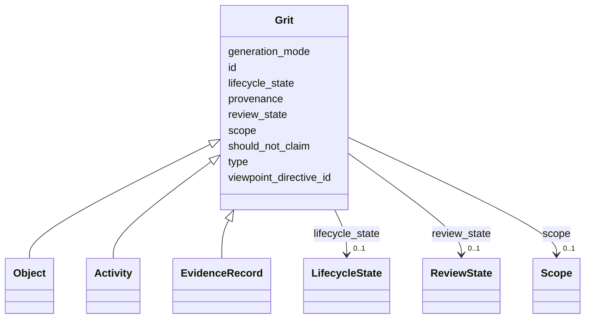

---
search:
  boost: 10.0
---

# Class: Grit 


_Abstract base for all pygrits graph nodes. Carries the discipline contract: identity, type, viewpoint, provenance, lifecycle, review state, should_not_claim, scope, generation mode. Three concrete role subclasses: Object, Activity, EvidenceRecord._


<div data-search-exclude markdown="1">


* __NOTE__: this is an abstract class and should not be instantiated directly


URI: [prov:Entity](http://www.w3.org/ns/prov#Entity)





## Inheritance
* **Grit**
    * [Object](Object.md)
    * [Activity](Activity.md)
    * [EvidenceRecord](EvidenceRecord.md)


## Class Properties

| Property | Value |
| --- | --- |
| Class URI | [prov:Entity](http://www.w3.org/ns/prov#Entity) |


## Slots

| Name | Cardinality and Range | Description | Inheritance |
| ---  | --- | --- | --- |
| [id](id.md) | 1 <br/> [GritId](GritId.md) | Canonical grit identifier | direct |
| [type](type.md) | 1 <br/> [CurieOrUri](CurieOrUri.md) | For Object and EvidenceRecord, a CURIE into a viewpoint vocabulary | direct |
| [viewpoint_directive_id](viewpoint_directive_id.md) | 1 <br/> [GritId](GritId.md) | Reference to the ViewpointDirective that shaped this grit | direct |
| [provenance](provenance.md) | 1 <br/> [String](String.md) | Provenance description for v1 | direct |
| [should_not_claim](should_not_claim.md) | 1..* <br/> [String](String.md) | Epistemic boundaries this grit must respect | direct |
| [scope](scope.md) | 0..1 <br/> [Scope](Scope.md) | Optional but recommended | direct |
| [review_state](review_state.md) | 0..1 <br/> [ReviewState](ReviewState.md) |  | direct |
| [lifecycle_state](lifecycle_state.md) | 0..1 <br/> [LifecycleState](LifecycleState.md) |  | direct |
| [generation_mode](generation_mode.md) | 0..1 <br/> [String](String.md) | Free-form descriptor of the process that generated this grit (parser name + v... | direct |


## Identifier and Mapping Information


### Schema Source


* from schema: https://w3id.org/grits/core


## Mappings

| Mapping Type | Mapped Value |
| ---  | ---  |
| self | prov:Entity |
| native | grits:Grit |


## LinkML Source

<!-- TODO: investigate https://stackoverflow.com/questions/37606292/how-to-create-tabbed-code-blocks-in-mkdocs-or-sphinx -->

### Direct

<details>
```yaml
name: Grit
description: 'Abstract base for all pygrits graph nodes. Carries the discipline contract:
  identity, type, viewpoint, provenance, lifecycle, review state, should_not_claim,
  scope, generation mode. Three concrete role subclasses: Object, Activity, EvidenceRecord.'
from_schema: https://w3id.org/grits/core
abstract: true
attributes:
  id:
    name: id
    description: Canonical grit identifier.
    in_subset:
    - MVE
    from_schema: https://w3id.org/grits/core
    rank: 1000
    identifier: true
    domain_of:
    - Grit
    range: GritId
    required: true
  type:
    name: type
    description: For Object and EvidenceRecord, a CURIE into a viewpoint vocabulary.
      For Activity, a CURIE corresponding to the ActivityType value (e.g. grits:activity_type/synthesis_edge).
    in_subset:
    - MVE
    from_schema: https://w3id.org/grits/core
    rank: 1000
    domain_of:
    - Grit
    range: CurieOrUri
    required: true
  viewpoint_directive_id:
    name: viewpoint_directive_id
    description: Reference to the ViewpointDirective that shaped this grit. The bootstrap
      meta-viewpoint and the blank-slate viewpoint are valid references; absence is
      not.
    in_subset:
    - MVE
    from_schema: https://w3id.org/grits/core
    domain_of:
    - Confidence
    - CompatibilityJudgment
    - Grit
    range: GritId
    required: true
  provenance:
    name: provenance
    description: Provenance description for v1. Future versions will model provenance
      as structured edges into the hyperDAG; for now a free-form string is accepted
      to allow ingestion bundles from upstream extraction tools.
    in_subset:
    - MVE
    from_schema: https://w3id.org/grits/core
    rank: 1000
    domain_of:
    - Grit
    range: string
    required: true
  should_not_claim:
    name: should_not_claim
    description: Epistemic boundaries this grit must respect. Combination of per-class
      defaults plus directive-imposed rules from the viewpoint.
    in_subset:
    - MVE
    from_schema: https://w3id.org/grits/core
    rank: 1000
    domain_of:
    - Grit
    range: string
    required: true
    multivalued: true
  scope:
    name: scope
    description: Optional but recommended. Viewpoint-supplied scope dimensions describing
      the conditions under which this grit's statements apply. The core Scope marker
      carries no domain dimensions; load a viewpoint schema to populate them.
    from_schema: https://w3id.org/grits/core
    rank: 1000
    domain_of:
    - Grit
    range: Scope
    inlined: true
  review_state:
    name: review_state
    from_schema: https://w3id.org/grits/core
    rank: 1000
    domain_of:
    - Grit
    range: ReviewState
  lifecycle_state:
    name: lifecycle_state
    from_schema: https://w3id.org/grits/core
    rank: 1000
    domain_of:
    - Grit
    range: LifecycleState
  generation_mode:
    name: generation_mode
    description: Free-form descriptor of the process that generated this grit (parser
      name + version, viewpoint name + version, LLM model + tier).
    from_schema: https://w3id.org/grits/core
    rank: 1000
    domain_of:
    - Grit
    range: string
class_uri: prov:Entity

```
</details>

### Induced

<details>
```yaml
name: Grit
description: 'Abstract base for all pygrits graph nodes. Carries the discipline contract:
  identity, type, viewpoint, provenance, lifecycle, review state, should_not_claim,
  scope, generation mode. Three concrete role subclasses: Object, Activity, EvidenceRecord.'
from_schema: https://w3id.org/grits/core
abstract: true
attributes:
  id:
    name: id
    description: Canonical grit identifier.
    in_subset:
    - MVE
    from_schema: https://w3id.org/grits/core
    rank: 1000
    identifier: true
    owner: Grit
    domain_of:
    - Grit
    range: GritId
    required: true
  type:
    name: type
    description: For Object and EvidenceRecord, a CURIE into a viewpoint vocabulary.
      For Activity, a CURIE corresponding to the ActivityType value (e.g. grits:activity_type/synthesis_edge).
    in_subset:
    - MVE
    from_schema: https://w3id.org/grits/core
    rank: 1000
    owner: Grit
    domain_of:
    - Grit
    range: CurieOrUri
    required: true
  viewpoint_directive_id:
    name: viewpoint_directive_id
    description: Reference to the ViewpointDirective that shaped this grit. The bootstrap
      meta-viewpoint and the blank-slate viewpoint are valid references; absence is
      not.
    in_subset:
    - MVE
    from_schema: https://w3id.org/grits/core
    owner: Grit
    domain_of:
    - Confidence
    - CompatibilityJudgment
    - Grit
    range: GritId
    required: true
  provenance:
    name: provenance
    description: Provenance description for v1. Future versions will model provenance
      as structured edges into the hyperDAG; for now a free-form string is accepted
      to allow ingestion bundles from upstream extraction tools.
    in_subset:
    - MVE
    from_schema: https://w3id.org/grits/core
    rank: 1000
    owner: Grit
    domain_of:
    - Grit
    range: string
    required: true
  should_not_claim:
    name: should_not_claim
    description: Epistemic boundaries this grit must respect. Combination of per-class
      defaults plus directive-imposed rules from the viewpoint.
    in_subset:
    - MVE
    from_schema: https://w3id.org/grits/core
    rank: 1000
    owner: Grit
    domain_of:
    - Grit
    range: string
    required: true
    multivalued: true
  scope:
    name: scope
    description: Optional but recommended. Viewpoint-supplied scope dimensions describing
      the conditions under which this grit's statements apply. The core Scope marker
      carries no domain dimensions; load a viewpoint schema to populate them.
    from_schema: https://w3id.org/grits/core
    rank: 1000
    owner: Grit
    domain_of:
    - Grit
    range: Scope
    inlined: true
  review_state:
    name: review_state
    from_schema: https://w3id.org/grits/core
    rank: 1000
    owner: Grit
    domain_of:
    - Grit
    range: ReviewState
  lifecycle_state:
    name: lifecycle_state
    from_schema: https://w3id.org/grits/core
    rank: 1000
    owner: Grit
    domain_of:
    - Grit
    range: LifecycleState
  generation_mode:
    name: generation_mode
    description: Free-form descriptor of the process that generated this grit (parser
      name + version, viewpoint name + version, LLM model + tier).
    from_schema: https://w3id.org/grits/core
    rank: 1000
    owner: Grit
    domain_of:
    - Grit
    range: string
class_uri: prov:Entity

```
</details></div>