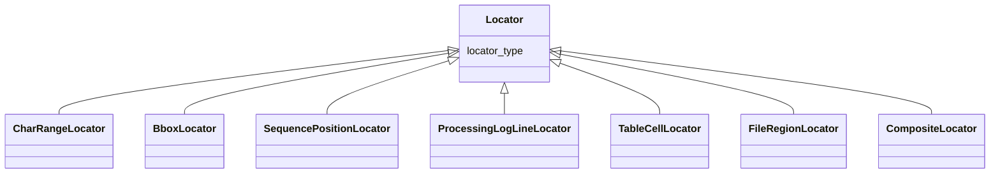

---
search:
  boost: 10.0
---

# Class: Locator 


_Polymorphic locator into a source artifact. Describes HOW an anchor into a source artifact is shaped (character range, bounding box, sequence position, etc.), not WHAT kind of content the source contains. Discriminator is locator_type._


<div data-search-exclude markdown="1">


* __NOTE__: this is an abstract class and should not be instantiated directly


URI: [isom:Locator](https://w3id.org/isom/Locator)





## Inheritance
* **Locator**
    * [CharRangeLocator](CharRangeLocator.md)
    * [BboxLocator](BboxLocator.md)
    * [SequencePositionLocator](SequencePositionLocator.md)
    * [ProcessingLogLineLocator](ProcessingLogLineLocator.md)
    * [TableCellLocator](TableCellLocator.md)
    * [FileRegionLocator](FileRegionLocator.md)
    * [CompositeLocator](CompositeLocator.md)


## Slots

| Name | Cardinality and Range | Description | Inheritance |
| ---  | --- | --- | --- |
| [locator_type](locator_type.md) | 1 <br/> [String](String.md) | Class name of the concrete Locator subclass (e | direct |


## Usages

| used by | used in | type | used |
| ---  | --- | --- | --- |
| [CompositeLocator](CompositeLocator.md) | [members](members.md) | range | [Locator](Locator.md) |
| [EvidenceRecord](EvidenceRecord.md) | [locator](locator.md) | range | [Locator](Locator.md) |
| [NegativeEvidenceRecord](NegativeEvidenceRecord.md) | [locator](locator.md) | range | [Locator](Locator.md) |


## Identifier and Mapping Information


### Schema Source


* from schema: https://w3id.org/isom/core


## Mappings

| Mapping Type | Mapped Value |
| ---  | ---  |
| self | isom:Locator |
| native | isom:Locator |


## LinkML Source

<!-- TODO: investigate https://stackoverflow.com/questions/37606292/how-to-create-tabbed-code-blocks-in-mkdocs-or-sphinx -->

### Direct

<details>
```yaml
name: Locator
description: Polymorphic locator into a source artifact. Describes HOW an anchor into
  a source artifact is shaped (character range, bounding box, sequence position, etc.),
  not WHAT kind of content the source contains. Discriminator is locator_type.
from_schema: https://w3id.org/isom/core
abstract: true
attributes:
  locator_type:
    name: locator_type
    description: Class name of the concrete Locator subclass (e.g. CharRangeLocator).
    from_schema: https://w3id.org/isom/core
    rank: 1000
    designates_type: true
    domain_of:
    - Locator
    range: string
    required: true

```
</details>

### Induced

<details>
```yaml
name: Locator
description: Polymorphic locator into a source artifact. Describes HOW an anchor into
  a source artifact is shaped (character range, bounding box, sequence position, etc.),
  not WHAT kind of content the source contains. Discriminator is locator_type.
from_schema: https://w3id.org/isom/core
abstract: true
attributes:
  locator_type:
    name: locator_type
    description: Class name of the concrete Locator subclass (e.g. CharRangeLocator).
    from_schema: https://w3id.org/isom/core
    rank: 1000
    designates_type: true
    owner: Locator
    domain_of:
    - Locator
    range: string
    required: true

```
</details></div>