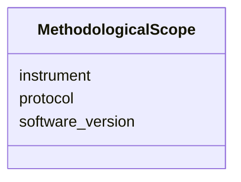

---
search:
  boost: 10.0
---

# Class: MethodologicalScope 


_Instrument, protocol, software version._


<div data-search-exclude markdown="1">


URI: [isom:MethodologicalScope](https://w3id.org/isom/MethodologicalScope)





<!-- no inheritance hierarchy -->

## Slots

| Name | Cardinality and Range | Description | Inheritance |
| ---  | --- | --- | --- |
| [instrument](instrument.md) | 0..1 <br/> [String](String.md) |  | direct |
| [protocol](protocol.md) | 0..1 <br/> [String](String.md) |  | direct |
| [software_version](software_version.md) | 0..1 <br/> [String](String.md) |  | direct |


## Usages

| used by | used in | type | used |
| ---  | --- | --- | --- |
| [Scope](Scope.md) | [methodological](methodological.md) | range | [MethodologicalScope](MethodologicalScope.md) |


## Identifier and Mapping Information


### Schema Source


* from schema: https://w3id.org/isom/core


## Mappings

| Mapping Type | Mapped Value |
| ---  | ---  |
| self | isom:MethodologicalScope |
| native | isom:MethodologicalScope |


## LinkML Source

<!-- TODO: investigate https://stackoverflow.com/questions/37606292/how-to-create-tabbed-code-blocks-in-mkdocs-or-sphinx -->

### Direct

<details>
```yaml
name: MethodologicalScope
description: Instrument, protocol, software version.
from_schema: https://w3id.org/isom/core
attributes:
  instrument:
    name: instrument
    from_schema: https://w3id.org/isom/core
    rank: 1000
    domain_of:
    - MethodologicalScope
    range: string
  protocol:
    name: protocol
    from_schema: https://w3id.org/isom/core
    rank: 1000
    domain_of:
    - MethodologicalScope
    range: string
  software_version:
    name: software_version
    from_schema: https://w3id.org/isom/core
    rank: 1000
    domain_of:
    - MethodologicalScope
    range: string

```
</details>

### Induced

<details>
```yaml
name: MethodologicalScope
description: Instrument, protocol, software version.
from_schema: https://w3id.org/isom/core
attributes:
  instrument:
    name: instrument
    from_schema: https://w3id.org/isom/core
    rank: 1000
    owner: MethodologicalScope
    domain_of:
    - MethodologicalScope
    range: string
  protocol:
    name: protocol
    from_schema: https://w3id.org/isom/core
    rank: 1000
    owner: MethodologicalScope
    domain_of:
    - MethodologicalScope
    range: string
  software_version:
    name: software_version
    from_schema: https://w3id.org/isom/core
    rank: 1000
    owner: MethodologicalScope
    domain_of:
    - MethodologicalScope
    range: string

```
</details></div>