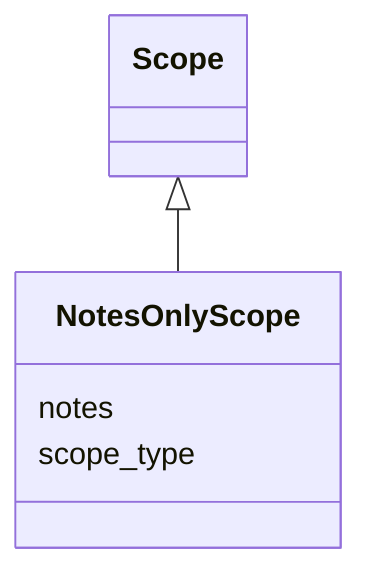

---
search:
  boost: 10.0
---

# Class: NotesOnlyScope 


_Scope marker with only free-form notes; no domain dimensions._


<div data-search-exclude markdown="1">


URI: [isom:NotesOnlyScope](https://w3id.org/isom/NotesOnlyScope)





## Inheritance
* [Scope](Scope.md)
    * **NotesOnlyScope**


## Slots

| Name | Cardinality and Range | Description | Inheritance |
| ---  | --- | --- | --- |
| [scope_type](scope_type.md) | 1 <br/> [String](String.md) | Class name of the concrete Scope subclass (e | [Scope](Scope.md) |
| [notes](notes.md) | 0..1 <br/> [String](String.md) | Free-text scope clarification | [Scope](Scope.md) |


## Identifier and Mapping Information


### Schema Source


* from schema: https://w3id.org/isom/core


## Mappings

| Mapping Type | Mapped Value |
| ---  | ---  |
| self | isom:NotesOnlyScope |
| native | isom:NotesOnlyScope |


## LinkML Source

<!-- TODO: investigate https://stackoverflow.com/questions/37606292/how-to-create-tabbed-code-blocks-in-mkdocs-or-sphinx -->

### Direct

<details>
```yaml
name: NotesOnlyScope
description: Scope marker with only free-form notes; no domain dimensions.
from_schema: https://w3id.org/isom/core
is_a: Scope

```
</details>

### Induced

<details>
```yaml
name: NotesOnlyScope
description: Scope marker with only free-form notes; no domain dimensions.
from_schema: https://w3id.org/isom/core
is_a: Scope
attributes:
  scope_type:
    name: scope_type
    description: Class name of the concrete Scope subclass (e.g. NotesOnlyScope).
    from_schema: https://w3id.org/isom/core
    rank: 1000
    designates_type: true
    owner: NotesOnlyScope
    domain_of:
    - Scope
    range: string
    required: true
  notes:
    name: notes
    description: Free-text scope clarification.
    from_schema: https://w3id.org/isom/core
    rank: 1000
    owner: NotesOnlyScope
    domain_of:
    - Scope
    range: string

```
</details></div>