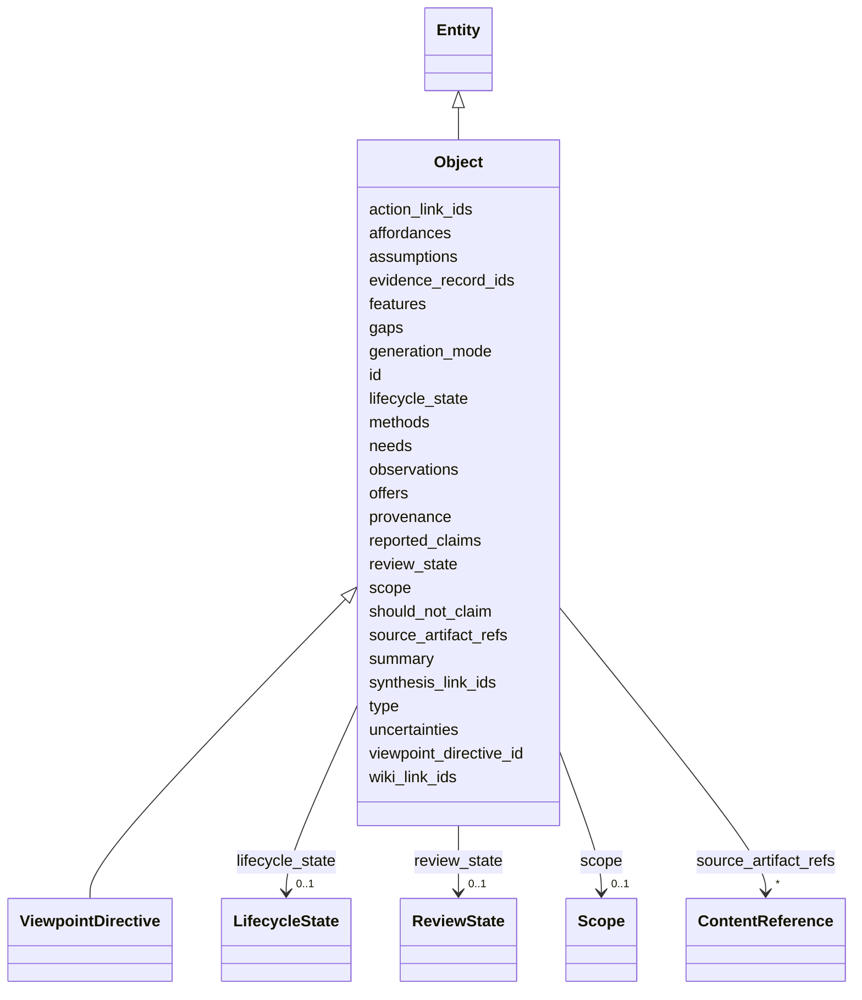

---
search:
  boost: 10.0
---

# Class: Object 


_Participant in reasoning. Has source artifacts, evidence records, features, observations, needs, offers, posts, communities. The thing being talked about._


<div data-search-exclude markdown="1">


URI: [isom:Object](https://w3id.org/isom/Object)





## Inheritance
* [Entity](Entity.md)
    * **Object**
        * [ViewpointDirective](ViewpointDirective.md)


## Slots

| Name | Cardinality and Range | Description | Inheritance |
| ---  | --- | --- | --- |
| [source_artifact_refs](source_artifact_refs.md) | * <br/> [ContentReference](ContentReference.md) | ContentReferences to the source artifacts this Object derives from | direct |
| [evidence_record_ids](evidence_record_ids.md) | * <br/> [EntityId](EntityId.md) | References to EvidenceRecord entities anchoring this Object's claims | direct |
| [summary](summary.md) | 0..1 <br/> [String](String.md) |  | direct |
| [features](features.md) | 0..1 <br/> [String](String.md) | Viewpoint-defined structured payload, serialized as a JSON string in v1 | direct |
| [observations](observations.md) | * <br/> [String](String.md) |  | direct |
| [gaps](gaps.md) | * <br/> [String](String.md) |  | direct |
| [needs](needs.md) | * <br/> [String](String.md) |  | direct |
| [offers](offers.md) | * <br/> [String](String.md) |  | direct |
| [affordances](affordances.md) | * <br/> [String](String.md) |  | direct |
| [reported_claims](reported_claims.md) | * <br/> [String](String.md) |  | direct |
| [methods](methods.md) | * <br/> [String](String.md) |  | direct |
| [assumptions](assumptions.md) | * <br/> [String](String.md) |  | direct |
| [uncertainties](uncertainties.md) | * <br/> [String](String.md) |  | direct |
| [synthesis_link_ids](synthesis_link_ids.md) | * <br/> [EntityId](EntityId.md) | Backward pointers to Activities that referenced this Object as input or outpu... | direct |
| [wiki_link_ids](wiki_link_ids.md) | * <br/> [EntityId](EntityId.md) | Backward pointers to wiki statement Objects citing this Object | direct |
| [action_link_ids](action_link_ids.md) | * <br/> [EntityId](EntityId.md) | Backward pointers to ACTION_EDGE Activities involving this Object | direct |
| [id](id.md) | 1 <br/> [EntityId](EntityId.md) | Canonical entity identifier | [Entity](Entity.md) |
| [type](type.md) | 1 <br/> [CurieOrUri](CurieOrUri.md) | For Object and EvidenceRecord, a CURIE into a viewpoint vocabulary | [Entity](Entity.md) |
| [viewpoint_directive_id](viewpoint_directive_id.md) | 1 <br/> [EntityId](EntityId.md) | Reference to the ViewpointDirective that shaped this entity | [Entity](Entity.md) |
| [provenance](provenance.md) | 1 <br/> [String](String.md) | Provenance description for v1 | [Entity](Entity.md) |
| [should_not_claim](should_not_claim.md) | 1..* <br/> [String](String.md) | Epistemic boundaries this entity must respect | [Entity](Entity.md) |
| [scope](scope.md) | 0..1 <br/> [Scope](Scope.md) | Optional but recommended | [Entity](Entity.md) |
| [review_state](review_state.md) | 0..1 <br/> [ReviewState](ReviewState.md) |  | [Entity](Entity.md) |
| [lifecycle_state](lifecycle_state.md) | 0..1 <br/> [LifecycleState](LifecycleState.md) |  | [Entity](Entity.md) |
| [generation_mode](generation_mode.md) | 0..1 <br/> [String](String.md) | Free-form descriptor of the process that generated this entity (parser name +... | [Entity](Entity.md) |


## Identifier and Mapping Information


### Schema Source


* from schema: https://w3id.org/isom/core


## Mappings

| Mapping Type | Mapped Value |
| ---  | ---  |
| self | isom:Object |
| native | isom:Object |


## LinkML Source

<!-- TODO: investigate https://stackoverflow.com/questions/37606292/how-to-create-tabbed-code-blocks-in-mkdocs-or-sphinx -->

### Direct

<details>
```yaml
name: Object
description: Participant in reasoning. Has source artifacts, evidence records, features,
  observations, needs, offers, posts, communities. The thing being talked about.
from_schema: https://w3id.org/isom/core
is_a: Entity
attributes:
  source_artifact_refs:
    name: source_artifact_refs
    description: ContentReferences to the source artifacts this Object derives from.
    in_subset:
    - MVE
    from_schema: https://w3id.org/isom/core
    rank: 1000
    domain_of:
    - Object
    range: ContentReference
    multivalued: true
    inlined: true
    inlined_as_list: true
  evidence_record_ids:
    name: evidence_record_ids
    description: References to EvidenceRecord entities anchoring this Object's claims.
    in_subset:
    - MVE
    from_schema: https://w3id.org/isom/core
    rank: 1000
    domain_of:
    - Object
    range: EntityId
    multivalued: true
  summary:
    name: summary
    in_subset:
    - ParticipationReady
    from_schema: https://w3id.org/isom/core
    rank: 1000
    domain_of:
    - Object
    range: string
  features:
    name: features
    description: Viewpoint-defined structured payload, serialized as a JSON string
      in v1. The viewpoint's vocabulary determines the shape. Later versions may use
      a typed Any with viewpoint-declared schemas.
    in_subset:
    - ParticipationReady
    from_schema: https://w3id.org/isom/core
    rank: 1000
    domain_of:
    - Object
    range: string
  observations:
    name: observations
    in_subset:
    - ParticipationReady
    from_schema: https://w3id.org/isom/core
    rank: 1000
    domain_of:
    - Object
    range: string
    multivalued: true
  gaps:
    name: gaps
    in_subset:
    - ParticipationReady
    from_schema: https://w3id.org/isom/core
    rank: 1000
    domain_of:
    - Object
    range: string
    multivalued: true
  needs:
    name: needs
    in_subset:
    - ParticipationReady
    from_schema: https://w3id.org/isom/core
    rank: 1000
    domain_of:
    - Object
    range: string
    multivalued: true
  offers:
    name: offers
    in_subset:
    - ParticipationReady
    from_schema: https://w3id.org/isom/core
    rank: 1000
    domain_of:
    - Object
    range: string
    multivalued: true
  affordances:
    name: affordances
    in_subset:
    - ParticipationReady
    from_schema: https://w3id.org/isom/core
    rank: 1000
    domain_of:
    - Object
    range: string
    multivalued: true
  reported_claims:
    name: reported_claims
    in_subset:
    - Full
    from_schema: https://w3id.org/isom/core
    rank: 1000
    domain_of:
    - Object
    range: string
    multivalued: true
  methods:
    name: methods
    in_subset:
    - Full
    from_schema: https://w3id.org/isom/core
    rank: 1000
    domain_of:
    - Object
    range: string
    multivalued: true
  assumptions:
    name: assumptions
    in_subset:
    - Full
    from_schema: https://w3id.org/isom/core
    domain_of:
    - CompatibilityJudgment
    - Object
    - Activity
    range: string
    multivalued: true
  uncertainties:
    name: uncertainties
    in_subset:
    - Full
    from_schema: https://w3id.org/isom/core
    rank: 1000
    domain_of:
    - Object
    range: string
    multivalued: true
  synthesis_link_ids:
    name: synthesis_link_ids
    description: Backward pointers to Activities that referenced this Object as input
      or output.
    in_subset:
    - Full
    from_schema: https://w3id.org/isom/core
    rank: 1000
    domain_of:
    - Object
    range: EntityId
    multivalued: true
  wiki_link_ids:
    name: wiki_link_ids
    description: Backward pointers to wiki statement Objects citing this Object.
    in_subset:
    - Full
    from_schema: https://w3id.org/isom/core
    rank: 1000
    domain_of:
    - Object
    range: EntityId
    multivalued: true
  action_link_ids:
    name: action_link_ids
    description: Backward pointers to ACTION_EDGE Activities involving this Object.
    in_subset:
    - Full
    from_schema: https://w3id.org/isom/core
    rank: 1000
    domain_of:
    - Object
    range: EntityId
    multivalued: true

```
</details>

### Induced

<details>
```yaml
name: Object
description: Participant in reasoning. Has source artifacts, evidence records, features,
  observations, needs, offers, posts, communities. The thing being talked about.
from_schema: https://w3id.org/isom/core
is_a: Entity
attributes:
  source_artifact_refs:
    name: source_artifact_refs
    description: ContentReferences to the source artifacts this Object derives from.
    in_subset:
    - MVE
    from_schema: https://w3id.org/isom/core
    rank: 1000
    owner: Object
    domain_of:
    - Object
    range: ContentReference
    multivalued: true
    inlined: true
    inlined_as_list: true
  evidence_record_ids:
    name: evidence_record_ids
    description: References to EvidenceRecord entities anchoring this Object's claims.
    in_subset:
    - MVE
    from_schema: https://w3id.org/isom/core
    rank: 1000
    owner: Object
    domain_of:
    - Object
    range: EntityId
    multivalued: true
  summary:
    name: summary
    in_subset:
    - ParticipationReady
    from_schema: https://w3id.org/isom/core
    rank: 1000
    owner: Object
    domain_of:
    - Object
    range: string
  features:
    name: features
    description: Viewpoint-defined structured payload, serialized as a JSON string
      in v1. The viewpoint's vocabulary determines the shape. Later versions may use
      a typed Any with viewpoint-declared schemas.
    in_subset:
    - ParticipationReady
    from_schema: https://w3id.org/isom/core
    rank: 1000
    owner: Object
    domain_of:
    - Object
    range: string
  observations:
    name: observations
    in_subset:
    - ParticipationReady
    from_schema: https://w3id.org/isom/core
    rank: 1000
    owner: Object
    domain_of:
    - Object
    range: string
    multivalued: true
  gaps:
    name: gaps
    in_subset:
    - ParticipationReady
    from_schema: https://w3id.org/isom/core
    rank: 1000
    owner: Object
    domain_of:
    - Object
    range: string
    multivalued: true
  needs:
    name: needs
    in_subset:
    - ParticipationReady
    from_schema: https://w3id.org/isom/core
    rank: 1000
    owner: Object
    domain_of:
    - Object
    range: string
    multivalued: true
  offers:
    name: offers
    in_subset:
    - ParticipationReady
    from_schema: https://w3id.org/isom/core
    rank: 1000
    owner: Object
    domain_of:
    - Object
    range: string
    multivalued: true
  affordances:
    name: affordances
    in_subset:
    - ParticipationReady
    from_schema: https://w3id.org/isom/core
    rank: 1000
    owner: Object
    domain_of:
    - Object
    range: string
    multivalued: true
  reported_claims:
    name: reported_claims
    in_subset:
    - Full
    from_schema: https://w3id.org/isom/core
    rank: 1000
    owner: Object
    domain_of:
    - Object
    range: string
    multivalued: true
  methods:
    name: methods
    in_subset:
    - Full
    from_schema: https://w3id.org/isom/core
    rank: 1000
    owner: Object
    domain_of:
    - Object
    range: string
    multivalued: true
  assumptions:
    name: assumptions
    in_subset:
    - Full
    from_schema: https://w3id.org/isom/core
    owner: Object
    domain_of:
    - CompatibilityJudgment
    - Object
    - Activity
    range: string
    multivalued: true
  uncertainties:
    name: uncertainties
    in_subset:
    - Full
    from_schema: https://w3id.org/isom/core
    rank: 1000
    owner: Object
    domain_of:
    - Object
    range: string
    multivalued: true
  synthesis_link_ids:
    name: synthesis_link_ids
    description: Backward pointers to Activities that referenced this Object as input
      or output.
    in_subset:
    - Full
    from_schema: https://w3id.org/isom/core
    rank: 1000
    owner: Object
    domain_of:
    - Object
    range: EntityId
    multivalued: true
  wiki_link_ids:
    name: wiki_link_ids
    description: Backward pointers to wiki statement Objects citing this Object.
    in_subset:
    - Full
    from_schema: https://w3id.org/isom/core
    rank: 1000
    owner: Object
    domain_of:
    - Object
    range: EntityId
    multivalued: true
  action_link_ids:
    name: action_link_ids
    description: Backward pointers to ACTION_EDGE Activities involving this Object.
    in_subset:
    - Full
    from_schema: https://w3id.org/isom/core
    rank: 1000
    owner: Object
    domain_of:
    - Object
    range: EntityId
    multivalued: true
  id:
    name: id
    description: Canonical entity identifier.
    in_subset:
    - MVE
    from_schema: https://w3id.org/isom/core
    rank: 1000
    identifier: true
    owner: Object
    domain_of:
    - Entity
    range: EntityId
    required: true
  type:
    name: type
    description: For Object and EvidenceRecord, a CURIE into a viewpoint vocabulary.
      For Activity, a CURIE corresponding to the ActivityType value (e.g. isom:activity_type/synthesis_edge).
    in_subset:
    - MVE
    from_schema: https://w3id.org/isom/core
    rank: 1000
    owner: Object
    domain_of:
    - Entity
    range: CurieOrUri
    required: true
  viewpoint_directive_id:
    name: viewpoint_directive_id
    description: Reference to the ViewpointDirective that shaped this entity. The
      bootstrap meta-viewpoint and the blank-slate viewpoint are valid references;
      absence is not.
    in_subset:
    - MVE
    from_schema: https://w3id.org/isom/core
    owner: Object
    domain_of:
    - Confidence
    - CompatibilityJudgment
    - Entity
    range: EntityId
    required: true
  provenance:
    name: provenance
    description: Provenance description for v1. Future versions will model provenance
      as structured edges into the hyperDAG; for now a free-form string is accepted
      to allow ingestion bundles from upstream extraction tools.
    in_subset:
    - MVE
    from_schema: https://w3id.org/isom/core
    rank: 1000
    owner: Object
    domain_of:
    - Entity
    range: string
    required: true
  should_not_claim:
    name: should_not_claim
    description: Epistemic boundaries this entity must respect. Combination of per-class
      defaults plus directive-imposed rules from the viewpoint.
    in_subset:
    - MVE
    from_schema: https://w3id.org/isom/core
    rank: 1000
    owner: Object
    domain_of:
    - Entity
    range: string
    required: true
    multivalued: true
  scope:
    name: scope
    description: Optional but recommended. Viewpoint-supplied scope dimensions describing
      the conditions under which this entity's statements apply. The core Scope marker
      carries no domain dimensions; load a viewpoint schema to populate them.
    from_schema: https://w3id.org/isom/core
    rank: 1000
    owner: Object
    domain_of:
    - Entity
    range: Scope
    inlined: true
  review_state:
    name: review_state
    from_schema: https://w3id.org/isom/core
    rank: 1000
    owner: Object
    domain_of:
    - Entity
    range: ReviewState
  lifecycle_state:
    name: lifecycle_state
    from_schema: https://w3id.org/isom/core
    rank: 1000
    owner: Object
    domain_of:
    - Entity
    range: LifecycleState
  generation_mode:
    name: generation_mode
    description: Free-form descriptor of the process that generated this entity (parser
      name + version, viewpoint name + version, LLM model + tier).
    from_schema: https://w3id.org/isom/core
    rank: 1000
    owner: Object
    domain_of:
    - Entity
    range: string

```
</details></div>