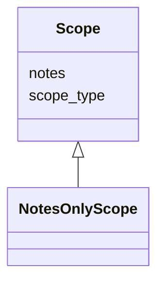

---
search:
  boost: 10.0
---

# Class: Scope 


_Container for viewpoint-supplied scope dimensions. The core defines no domain dimensions. Viewpoints subclass Scope in their own LinkML schemas to declare the scope commitments they populate._


<div data-search-exclude markdown="1">


* __NOTE__: this is an abstract class and should not be instantiated directly


URI: [isom:Scope](https://w3id.org/isom/Scope)





## Inheritance
* **Scope**
    * [NotesOnlyScope](NotesOnlyScope.md)


## Slots

| Name | Cardinality and Range | Description | Inheritance |
| ---  | --- | --- | --- |
| [scope_type](scope_type.md) | 1 <br/> [String](String.md) | Class name of the concrete Scope subclass (e | direct |
| [notes](notes.md) | 0..1 <br/> [String](String.md) | Free-text scope clarification | direct |


## Usages

| used by | used in | type | used |
| ---  | --- | --- | --- |
| [Entity](Entity.md) | [scope](scope.md) | range | [Scope](Scope.md) |
| [Object](Object.md) | [scope](scope.md) | range | [Scope](Scope.md) |
| [Activity](Activity.md) | [scope](scope.md) | range | [Scope](Scope.md) |
| [EvidenceRecord](EvidenceRecord.md) | [scope](scope.md) | range | [Scope](Scope.md) |
| [ViewpointDirective](ViewpointDirective.md) | [scope](scope.md) | range | [Scope](Scope.md) |
| [NegativeEvidenceRecord](NegativeEvidenceRecord.md) | [scope](scope.md) | range | [Scope](Scope.md) |


## Identifier and Mapping Information


### Schema Source


* from schema: https://w3id.org/isom/core


## Mappings

| Mapping Type | Mapped Value |
| ---  | ---  |
| self | isom:Scope |
| native | isom:Scope |


## LinkML Source

<!-- TODO: investigate https://stackoverflow.com/questions/37606292/how-to-create-tabbed-code-blocks-in-mkdocs-or-sphinx -->

### Direct

<details>
```yaml
name: Scope
description: Container for viewpoint-supplied scope dimensions. The core defines no
  domain dimensions. Viewpoints subclass Scope in their own LinkML schemas to declare
  the scope commitments they populate.
from_schema: https://w3id.org/isom/core
abstract: true
attributes:
  scope_type:
    name: scope_type
    description: Class name of the concrete Scope subclass (e.g. NotesOnlyScope).
    from_schema: https://w3id.org/isom/core
    rank: 1000
    designates_type: true
    domain_of:
    - Scope
    range: string
    required: true
  notes:
    name: notes
    description: Free-text scope clarification.
    from_schema: https://w3id.org/isom/core
    rank: 1000
    domain_of:
    - Scope
    range: string

```
</details>

### Induced

<details>
```yaml
name: Scope
description: Container for viewpoint-supplied scope dimensions. The core defines no
  domain dimensions. Viewpoints subclass Scope in their own LinkML schemas to declare
  the scope commitments they populate.
from_schema: https://w3id.org/isom/core
abstract: true
attributes:
  scope_type:
    name: scope_type
    description: Class name of the concrete Scope subclass (e.g. NotesOnlyScope).
    from_schema: https://w3id.org/isom/core
    rank: 1000
    designates_type: true
    owner: Scope
    domain_of:
    - Scope
    range: string
    required: true
  notes:
    name: notes
    description: Free-text scope clarification.
    from_schema: https://w3id.org/isom/core
    rank: 1000
    owner: Scope
    domain_of:
    - Scope
    range: string

```
</details></div>