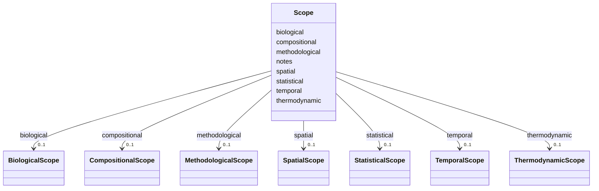

---
search:
  boost: 10.0
---

# Class: Scope 


_Composite scope. Each dimension is optional. An unset dimension is operationally `unspecified` — not a wildcard, but an honest acknowledgement that the viewpoint did not bind it._


<div data-search-exclude markdown="1">


URI: [isom:Scope](https://w3id.org/isom/Scope)





<!-- no inheritance hierarchy -->

## Slots

| Name | Cardinality and Range | Description | Inheritance |
| ---  | --- | --- | --- |
| [thermodynamic](thermodynamic.md) | 0..1 <br/> [ThermodynamicScope](ThermodynamicScope.md) |  | direct |
| [temporal](temporal.md) | 0..1 <br/> [TemporalScope](TemporalScope.md) |  | direct |
| [biological](biological.md) | 0..1 <br/> [BiologicalScope](BiologicalScope.md) |  | direct |
| [compositional](compositional.md) | 0..1 <br/> [CompositionalScope](CompositionalScope.md) |  | direct |
| [statistical](statistical.md) | 0..1 <br/> [StatisticalScope](StatisticalScope.md) |  | direct |
| [methodological](methodological.md) | 0..1 <br/> [MethodologicalScope](MethodologicalScope.md) |  | direct |
| [spatial](spatial.md) | 0..1 <br/> [SpatialScope](SpatialScope.md) |  | direct |
| [notes](notes.md) | 0..1 <br/> [String](String.md) | Free-text scope clarification | direct |


## Usages

| used by | used in | type | used |
| ---  | --- | --- | --- |
| [Entity](Entity.md) | [scope](scope.md) | range | [Scope](Scope.md) |
| [Object](Object.md) | [scope](scope.md) | range | [Scope](Scope.md) |
| [Activity](Activity.md) | [scope](scope.md) | range | [Scope](Scope.md) |
| [EvidenceRecord](EvidenceRecord.md) | [scope](scope.md) | range | [Scope](Scope.md) |
| [ViewpointDirective](ViewpointDirective.md) | [scope](scope.md) | range | [Scope](Scope.md) |
| [NegativeEvidenceRecord](NegativeEvidenceRecord.md) | [scope](scope.md) | range | [Scope](Scope.md) |


## Identifier and Mapping Information


### Schema Source


* from schema: https://w3id.org/isom/core


## Mappings

| Mapping Type | Mapped Value |
| ---  | ---  |
| self | isom:Scope |
| native | isom:Scope |


## LinkML Source

<!-- TODO: investigate https://stackoverflow.com/questions/37606292/how-to-create-tabbed-code-blocks-in-mkdocs-or-sphinx -->

### Direct

<details>
```yaml
name: Scope
description: Composite scope. Each dimension is optional. An unset dimension is operationally
  `unspecified` — not a wildcard, but an honest acknowledgement that the viewpoint
  did not bind it.
from_schema: https://w3id.org/isom/core
attributes:
  thermodynamic:
    name: thermodynamic
    from_schema: https://w3id.org/isom/core
    rank: 1000
    domain_of:
    - Scope
    range: ThermodynamicScope
    inlined: true
  temporal:
    name: temporal
    from_schema: https://w3id.org/isom/core
    rank: 1000
    domain_of:
    - Scope
    range: TemporalScope
    inlined: true
  biological:
    name: biological
    from_schema: https://w3id.org/isom/core
    rank: 1000
    domain_of:
    - Scope
    range: BiologicalScope
    inlined: true
  compositional:
    name: compositional
    from_schema: https://w3id.org/isom/core
    rank: 1000
    domain_of:
    - Scope
    range: CompositionalScope
    inlined: true
  statistical:
    name: statistical
    from_schema: https://w3id.org/isom/core
    rank: 1000
    domain_of:
    - Scope
    range: StatisticalScope
    inlined: true
  methodological:
    name: methodological
    from_schema: https://w3id.org/isom/core
    rank: 1000
    domain_of:
    - Scope
    range: MethodologicalScope
    inlined: true
  spatial:
    name: spatial
    from_schema: https://w3id.org/isom/core
    rank: 1000
    domain_of:
    - Scope
    range: SpatialScope
    inlined: true
  notes:
    name: notes
    description: Free-text scope clarification.
    from_schema: https://w3id.org/isom/core
    domain_of:
    - ThermodynamicScope
    - Scope
    range: string

```
</details>

### Induced

<details>
```yaml
name: Scope
description: Composite scope. Each dimension is optional. An unset dimension is operationally
  `unspecified` — not a wildcard, but an honest acknowledgement that the viewpoint
  did not bind it.
from_schema: https://w3id.org/isom/core
attributes:
  thermodynamic:
    name: thermodynamic
    from_schema: https://w3id.org/isom/core
    rank: 1000
    owner: Scope
    domain_of:
    - Scope
    range: ThermodynamicScope
    inlined: true
  temporal:
    name: temporal
    from_schema: https://w3id.org/isom/core
    rank: 1000
    owner: Scope
    domain_of:
    - Scope
    range: TemporalScope
    inlined: true
  biological:
    name: biological
    from_schema: https://w3id.org/isom/core
    rank: 1000
    owner: Scope
    domain_of:
    - Scope
    range: BiologicalScope
    inlined: true
  compositional:
    name: compositional
    from_schema: https://w3id.org/isom/core
    rank: 1000
    owner: Scope
    domain_of:
    - Scope
    range: CompositionalScope
    inlined: true
  statistical:
    name: statistical
    from_schema: https://w3id.org/isom/core
    rank: 1000
    owner: Scope
    domain_of:
    - Scope
    range: StatisticalScope
    inlined: true
  methodological:
    name: methodological
    from_schema: https://w3id.org/isom/core
    rank: 1000
    owner: Scope
    domain_of:
    - Scope
    range: MethodologicalScope
    inlined: true
  spatial:
    name: spatial
    from_schema: https://w3id.org/isom/core
    rank: 1000
    owner: Scope
    domain_of:
    - Scope
    range: SpatialScope
    inlined: true
  notes:
    name: notes
    description: Free-text scope clarification.
    from_schema: https://w3id.org/isom/core
    owner: Scope
    domain_of:
    - ThermodynamicScope
    - Scope
    range: string

```
</details></div>