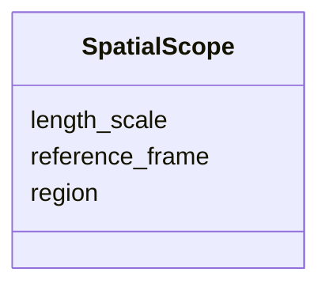

---
search:
  boost: 10.0
---

# Class: SpatialScope 


_Region, reference frame, length scale._


<div data-search-exclude markdown="1">


URI: [isom:SpatialScope](https://w3id.org/isom/SpatialScope)





<!-- no inheritance hierarchy -->

## Slots

| Name | Cardinality and Range | Description | Inheritance |
| ---  | --- | --- | --- |
| [region](region.md) | 0..1 <br/> [String](String.md) |  | direct |
| [reference_frame](reference_frame.md) | 0..1 <br/> [String](String.md) |  | direct |
| [length_scale](length_scale.md) | 0..1 <br/> [String](String.md) |  | direct |


## Usages

| used by | used in | type | used |
| ---  | --- | --- | --- |
| [Scope](Scope.md) | [spatial](spatial.md) | range | [SpatialScope](SpatialScope.md) |


## Identifier and Mapping Information


### Schema Source


* from schema: https://w3id.org/isom/core


## Mappings

| Mapping Type | Mapped Value |
| ---  | ---  |
| self | isom:SpatialScope |
| native | isom:SpatialScope |


## LinkML Source

<!-- TODO: investigate https://stackoverflow.com/questions/37606292/how-to-create-tabbed-code-blocks-in-mkdocs-or-sphinx -->

### Direct

<details>
```yaml
name: SpatialScope
description: Region, reference frame, length scale.
from_schema: https://w3id.org/isom/core
attributes:
  region:
    name: region
    from_schema: https://w3id.org/isom/core
    rank: 1000
    domain_of:
    - SpatialScope
    range: string
  reference_frame:
    name: reference_frame
    from_schema: https://w3id.org/isom/core
    rank: 1000
    domain_of:
    - SpatialScope
    range: string
  length_scale:
    name: length_scale
    from_schema: https://w3id.org/isom/core
    rank: 1000
    domain_of:
    - SpatialScope
    range: string

```
</details>

### Induced

<details>
```yaml
name: SpatialScope
description: Region, reference frame, length scale.
from_schema: https://w3id.org/isom/core
attributes:
  region:
    name: region
    from_schema: https://w3id.org/isom/core
    rank: 1000
    owner: SpatialScope
    domain_of:
    - SpatialScope
    range: string
  reference_frame:
    name: reference_frame
    from_schema: https://w3id.org/isom/core
    rank: 1000
    owner: SpatialScope
    domain_of:
    - SpatialScope
    range: string
  length_scale:
    name: length_scale
    from_schema: https://w3id.org/isom/core
    rank: 1000
    owner: SpatialScope
    domain_of:
    - SpatialScope
    range: string

```
</details></div>