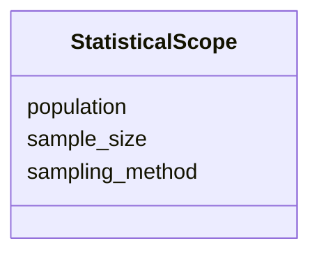

---
search:
  boost: 10.0
---

# Class: StatisticalScope 


_Sample size, population, sampling method._


<div data-search-exclude markdown="1">


URI: [isom:StatisticalScope](https://w3id.org/isom/StatisticalScope)





<!-- no inheritance hierarchy -->

## Slots

| Name | Cardinality and Range | Description | Inheritance |
| ---  | --- | --- | --- |
| [sample_size](sample_size.md) | 0..1 <br/> [Integer](Integer.md) |  | direct |
| [population](population.md) | 0..1 <br/> [String](String.md) |  | direct |
| [sampling_method](sampling_method.md) | 0..1 <br/> [String](String.md) |  | direct |


## Usages

| used by | used in | type | used |
| ---  | --- | --- | --- |
| [Scope](Scope.md) | [statistical](statistical.md) | range | [StatisticalScope](StatisticalScope.md) |


## Identifier and Mapping Information


### Schema Source


* from schema: https://w3id.org/isom/core


## Mappings

| Mapping Type | Mapped Value |
| ---  | ---  |
| self | isom:StatisticalScope |
| native | isom:StatisticalScope |


## LinkML Source

<!-- TODO: investigate https://stackoverflow.com/questions/37606292/how-to-create-tabbed-code-blocks-in-mkdocs-or-sphinx -->

### Direct

<details>
```yaml
name: StatisticalScope
description: Sample size, population, sampling method.
from_schema: https://w3id.org/isom/core
attributes:
  sample_size:
    name: sample_size
    from_schema: https://w3id.org/isom/core
    rank: 1000
    domain_of:
    - StatisticalScope
    range: integer
  population:
    name: population
    from_schema: https://w3id.org/isom/core
    rank: 1000
    domain_of:
    - StatisticalScope
    range: string
  sampling_method:
    name: sampling_method
    from_schema: https://w3id.org/isom/core
    rank: 1000
    domain_of:
    - StatisticalScope
    range: string

```
</details>

### Induced

<details>
```yaml
name: StatisticalScope
description: Sample size, population, sampling method.
from_schema: https://w3id.org/isom/core
attributes:
  sample_size:
    name: sample_size
    from_schema: https://w3id.org/isom/core
    rank: 1000
    owner: StatisticalScope
    domain_of:
    - StatisticalScope
    range: integer
  population:
    name: population
    from_schema: https://w3id.org/isom/core
    rank: 1000
    owner: StatisticalScope
    domain_of:
    - StatisticalScope
    range: string
  sampling_method:
    name: sampling_method
    from_schema: https://w3id.org/isom/core
    rank: 1000
    owner: StatisticalScope
    domain_of:
    - StatisticalScope
    range: string

```
</details></div>