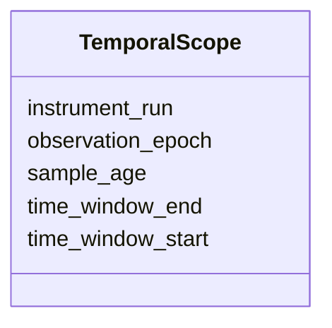

---
search:
  boost: 10.0
---

# Class: TemporalScope 


_Time window, sample age, instrument run, observation epoch._


<div data-search-exclude markdown="1">


URI: [isom:TemporalScope](https://w3id.org/isom/TemporalScope)





<!-- no inheritance hierarchy -->

## Slots

| Name | Cardinality and Range | Description | Inheritance |
| ---  | --- | --- | --- |
| [time_window_start](time_window_start.md) | 0..1 <br/> [Iso8601](Iso8601.md) |  | direct |
| [time_window_end](time_window_end.md) | 0..1 <br/> [Iso8601](Iso8601.md) |  | direct |
| [sample_age](sample_age.md) | 0..1 <br/> [String](String.md) |  | direct |
| [instrument_run](instrument_run.md) | 0..1 <br/> [String](String.md) |  | direct |
| [observation_epoch](observation_epoch.md) | 0..1 <br/> [String](String.md) |  | direct |


## Usages

| used by | used in | type | used |
| ---  | --- | --- | --- |
| [Scope](Scope.md) | [temporal](temporal.md) | range | [TemporalScope](TemporalScope.md) |


## Identifier and Mapping Information


### Schema Source


* from schema: https://w3id.org/isom/core


## Mappings

| Mapping Type | Mapped Value |
| ---  | ---  |
| self | isom:TemporalScope |
| native | isom:TemporalScope |


## LinkML Source

<!-- TODO: investigate https://stackoverflow.com/questions/37606292/how-to-create-tabbed-code-blocks-in-mkdocs-or-sphinx -->

### Direct

<details>
```yaml
name: TemporalScope
description: Time window, sample age, instrument run, observation epoch.
from_schema: https://w3id.org/isom/core
attributes:
  time_window_start:
    name: time_window_start
    from_schema: https://w3id.org/isom/core
    rank: 1000
    domain_of:
    - TemporalScope
    range: Iso8601
  time_window_end:
    name: time_window_end
    from_schema: https://w3id.org/isom/core
    rank: 1000
    domain_of:
    - TemporalScope
    range: Iso8601
  sample_age:
    name: sample_age
    from_schema: https://w3id.org/isom/core
    rank: 1000
    domain_of:
    - TemporalScope
    range: string
  instrument_run:
    name: instrument_run
    from_schema: https://w3id.org/isom/core
    rank: 1000
    domain_of:
    - TemporalScope
    range: string
  observation_epoch:
    name: observation_epoch
    from_schema: https://w3id.org/isom/core
    rank: 1000
    domain_of:
    - TemporalScope
    range: string

```
</details>

### Induced

<details>
```yaml
name: TemporalScope
description: Time window, sample age, instrument run, observation epoch.
from_schema: https://w3id.org/isom/core
attributes:
  time_window_start:
    name: time_window_start
    from_schema: https://w3id.org/isom/core
    rank: 1000
    owner: TemporalScope
    domain_of:
    - TemporalScope
    range: Iso8601
  time_window_end:
    name: time_window_end
    from_schema: https://w3id.org/isom/core
    rank: 1000
    owner: TemporalScope
    domain_of:
    - TemporalScope
    range: Iso8601
  sample_age:
    name: sample_age
    from_schema: https://w3id.org/isom/core
    rank: 1000
    owner: TemporalScope
    domain_of:
    - TemporalScope
    range: string
  instrument_run:
    name: instrument_run
    from_schema: https://w3id.org/isom/core
    rank: 1000
    owner: TemporalScope
    domain_of:
    - TemporalScope
    range: string
  observation_epoch:
    name: observation_epoch
    from_schema: https://w3id.org/isom/core
    rank: 1000
    owner: TemporalScope
    domain_of:
    - TemporalScope
    range: string

```
</details></div>