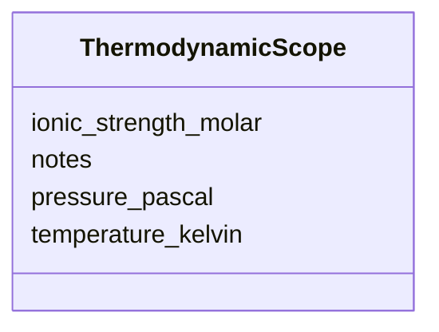

---
search:
  boost: 10.0
---

# Class: ThermodynamicScope 


_Temperature, pressure, ionic strength._


<div data-search-exclude markdown="1">


URI: [isom:ThermodynamicScope](https://w3id.org/isom/ThermodynamicScope)





<!-- no inheritance hierarchy -->

## Slots

| Name | Cardinality and Range | Description | Inheritance |
| ---  | --- | --- | --- |
| [temperature_kelvin](temperature_kelvin.md) | 0..1 <br/> [Float](Float.md) |  | direct |
| [pressure_pascal](pressure_pascal.md) | 0..1 <br/> [Float](Float.md) |  | direct |
| [ionic_strength_molar](ionic_strength_molar.md) | 0..1 <br/> [Float](Float.md) |  | direct |
| [notes](notes.md) | 0..1 <br/> [String](String.md) |  | direct |


## Usages

| used by | used in | type | used |
| ---  | --- | --- | --- |
| [Scope](Scope.md) | [thermodynamic](thermodynamic.md) | range | [ThermodynamicScope](ThermodynamicScope.md) |


## Identifier and Mapping Information


### Schema Source


* from schema: https://w3id.org/isom/core


## Mappings

| Mapping Type | Mapped Value |
| ---  | ---  |
| self | isom:ThermodynamicScope |
| native | isom:ThermodynamicScope |


## LinkML Source

<!-- TODO: investigate https://stackoverflow.com/questions/37606292/how-to-create-tabbed-code-blocks-in-mkdocs-or-sphinx -->

### Direct

<details>
```yaml
name: ThermodynamicScope
description: Temperature, pressure, ionic strength.
from_schema: https://w3id.org/isom/core
attributes:
  temperature_kelvin:
    name: temperature_kelvin
    from_schema: https://w3id.org/isom/core
    rank: 1000
    domain_of:
    - ThermodynamicScope
    range: float
  pressure_pascal:
    name: pressure_pascal
    from_schema: https://w3id.org/isom/core
    rank: 1000
    domain_of:
    - ThermodynamicScope
    range: float
  ionic_strength_molar:
    name: ionic_strength_molar
    from_schema: https://w3id.org/isom/core
    rank: 1000
    domain_of:
    - ThermodynamicScope
    range: float
  notes:
    name: notes
    from_schema: https://w3id.org/isom/core
    rank: 1000
    domain_of:
    - ThermodynamicScope
    - Scope
    range: string

```
</details>

### Induced

<details>
```yaml
name: ThermodynamicScope
description: Temperature, pressure, ionic strength.
from_schema: https://w3id.org/isom/core
attributes:
  temperature_kelvin:
    name: temperature_kelvin
    from_schema: https://w3id.org/isom/core
    rank: 1000
    owner: ThermodynamicScope
    domain_of:
    - ThermodynamicScope
    range: float
  pressure_pascal:
    name: pressure_pascal
    from_schema: https://w3id.org/isom/core
    rank: 1000
    owner: ThermodynamicScope
    domain_of:
    - ThermodynamicScope
    range: float
  ionic_strength_molar:
    name: ionic_strength_molar
    from_schema: https://w3id.org/isom/core
    rank: 1000
    owner: ThermodynamicScope
    domain_of:
    - ThermodynamicScope
    range: float
  notes:
    name: notes
    from_schema: https://w3id.org/isom/core
    rank: 1000
    owner: ThermodynamicScope
    domain_of:
    - ThermodynamicScope
    - Scope
    range: string

```
</details></div>