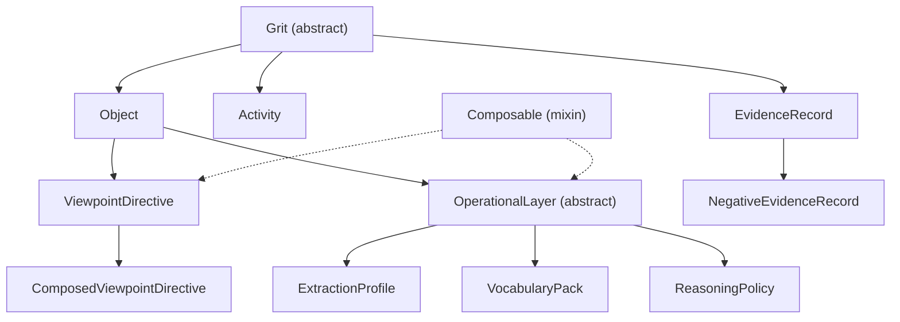

# pygrits object model

pygrits models scientific knowledge work as a typed, append-only graph of **grits**. Every node carries the same discipline contract; role classes differ in what they hold and how they connect.

## Hierarchy

## The discipline contract

Every grit — regardless of role — carries:

| Field | Purpose |
|-------|---------|
| `id` | Canonical identifier (`obj:…`, `act:…`, `evi:…`, `vpt:…`) |
| `type` | CURIE into viewpoint vocabulary (or `ActivityType` for Activities) |
| `viewpoint_directive_id` | Which interpretive frame shaped this grit |
| `provenance` | How this grit was produced |
| `should_not_claim` | Epistemic boundaries this grit must respect |
| `scope` | Conditions under which statements apply (viewpoint-supplied dimensions) |
| `review_state` | Epistemic maturity (`machine_generated`, `curator_reviewed`, …) |
| `lifecycle_state` | Processing stage (`ingested`, `active`, `synthesized`, …) |
| `generation_mode` | Process descriptor (parser version, model tier, …) |

Missing any **MVE** (minimum viable grit) field fails validation.

## Three roles, four layers

### Grit roles (what the graph contains)

| Class | Guide | One-line role |
|-------|-------|---------------|
| [Object](object.md) | Subject node | Holds claims, references sources and evidence |
| [Activity](activity.md) | Hyperedge | Records a transform; consumes inputs, emits outputs |
| [EvidenceRecord](evidence_record.md) | Anchor | Grounds data to a single source via a typed locator |

### Composable layers (how extraction and reasoning are configured)

| Class | Guide | One-line role |
|-------|-------|---------------|
| [ViewpointDirective](viewpoint_directive.md) | Epistemic admissibility | What may be claimed, refused, and under what scope |
| [ExtractionProfile](extraction_profile.md) | Grounding density | How finely content is decomposed and anchored |
| [VocabularyPack](vocabulary_pack.md) | Namespace surface | Which vocabularies and CURIE prefixes are active |
| [ReasoningPolicy](reasoning_policy.md) | Inferential permission | What synthesis, inference, and adjudication are allowed |

Layers compose into a [ComposedViewpointDirective](viewpoint_directive.md#composedviewpointdirective). See [composition.md](composition.md) for merge rules and `CompositionMode` semantics.

## Design principles

1. **Everything is a grit.** Domain labels (`mse:paper`, `pp:measurement`) are CURIE values of `type`, not Python classes in core.

2. **Activities never mutate inputs.** Outputs are new grits. The graph is append-only by construction.

3. **Extraction is viewpoint-defined.** Every grit names the `ViewpointDirective` that shaped it. The same source under different viewpoints yields different grits.

4. **Identity by declaration, integrity by content hash.** Human-readable names plus SHA-256 over canonical JSON (RFC 8785 JCS) or raw bytes.

5. **Refusal is first-class.** Five distinct refusal states (`unknown`, `not_searched`, `searched_absent`, `out_of_viewpoint`, `contradicted`) — never collapsed into a single "I don't know" or a fabricated answer.

## Further reading

- [composition.md](composition.md) — layer composition, merge rules, `compose_viewpoint()`
- [../examples/](../examples/) — core-level YAML instances
- [../viewpoints/](../viewpoints/) — viewpoint schemas and examples
- [../src/pygrits/core.yaml](../src/pygrits/core.yaml) — LinkML source of truth
